# Tier 4 Advisor Cockpit

The Tier 4 Advisor Cockpit is a guided, evidence-grounded application for running a two-call Throughput Audit. It helps an advisor research a company, draft and correct its Business Model Canvas, trace the flow of value, isolate the single constraint limiting throughput, preserve transcript evidence, and turn an approved diagnosis into implementation artifacts.

The governing outcome is:

> **One constraint -> one prescription -> one metric -> one named human owner**

## Start here: Practice mode

Practice mode is a complete, fictional engagement — Meridian Millwork — seeded into your own account so you can walk the whole arc before you sit in front of a client.

- **It needs no API keys and no configuration.** Everything in it is written into the repository (`lib/demo.ts`) and is deterministic; no model is called and no network request is made to seed it.
- **Open it from the Home screen**: the *Practice mode* card. That calls `GET /api/demo`, and `POST /api/demo {"action":"seed"}` the first time.
- **It is a real record in the real database**, scoped to you. The id is `eng_demo_practice_<your owner id>`, so two advisors never share one. Practice records are listed under their own heading, never interleaved with clients.
- **It is labelled everywhere**: a sticky hazard bar that cannot be dismissed and is deliberately *not* hidden on the client-facing screens, a lock mark in the header and in every list, `PRACTICE MODE — fictional training data, never send to a client` in the record itself, and a practice footer on all 14 generated documents.
- **It covers the whole engagement**: research, Canvas, value flow, both transcripts, synthesis, diagnosis, all deliverables, sprint, measured outcome, catalog entry. A 15-stop walkthrough docks beside the *real* screens rather than rebuilding fake ones; while the walkthrough is running, creating new engagements is disabled.
- **Reset or remove it** at any time (`POST /api/demo` with `{"action":"reset"}` or `{"action":"remove"}`). Reset rebuilds it byte-identically.

Because the practice bar stays visible on the call screens by design, practice mode is for rehearsal, not for a screen share with a live audience.

## Current status

**Snapshot:** 2026-07-27
**Application version:** `0.1.0`
**Branch:** `claude/repo-overview-b7tlrs`
**Previous host:** OpenAI Sites, owner-only ([tier4-advisor-cockpit.mattrob333.chatgpt.site](https://tier4-advisor-cockpit.mattrob333.chatgpt.site))
**Target host:** Cloudflare Workers — see [docs/DEPLOYMENT.md](./docs/DEPLOYMENT.md). `wrangler.jsonc` is in the repository; no completed Cloudflare deployment is recorded here yet.

> **Self-hosting warning.** On OpenAI Sites the advisor's identity arrived in a header Sites injected and visitors could not forge. Off Sites that header never arrives. Without Cloudflare Access configured (`CF_ACCESS_TEAM_DOMAIN`, `CF_ACCESS_AUD`, and `REQUIRE_ADVISOR_AUTH=1`), **anyone who has the URL is treated as the single local advisor and sees every engagement.** Read [Step 6 of docs/DEPLOYMENT.md](./docs/DEPLOYMENT.md) before putting client data in.

The workflow runs end to end, from intake to catalog write-back. Every screen downstream of research is driven by that engagement's own research. Records are scoped to the owning advisor in SQL. External writes are implemented and reachable only through an explicitly approved intent. Transcript synthesis is model-assisted with every quote verified against the real transcript, and falls back to the deterministic reading whenever no key is configured or the model call fails.

The two most significant remaining limits are that there is no native DOCX or PDF generator, and that the advisor still cannot correct a value-flow step live during the call. Both are in the table below.

### Capability truth table

| Capability | Current truth |
| --- | --- |
| Practice mode | Working; a complete fictional engagement seeded per advisor, with no credential of any kind. `lib/demo.ts`, `/api/demo` |
| Engagement intake and resume | Working; persisted in Cloudflare D1. Intake captures the primary contact's role as a real column |
| Source document at intake | Working; a TXT/VTT/SRT/JSON/DOCX file can be attached at intake and is decoded server-side. PDF is deliberately rejected |
| App authentication and tenancy | Working; every row carries `owner_id` and every query is scoped in SQL. All 25 API routes resolve the advisor with the async resolver |
| Cloudflare Access | Working; the `Cf-Access-Jwt-Assertion` signature, issuer, audience and expiry are verified against the team's published keys (`lib/access-jwt.ts`). When Access is configured it is the *only* accepted identity — no fallback to a header or the local advisor |
| Public website extraction | Working deterministic fallback with SSRF, DNS, redirect and response-size checks |
| OpenAI web research | Working when `OPENAI_API_KEY` is configured; `store: false`, strict schema, facts without retained source URLs are discarded |
| Business Model Canvas | One canonical Canvas (`lib/canvas.ts`), written by research and corrected by client evidence. A corrected research claim is superseded, never deleted. The audit report reads that same Canvas |
| Flow of Work screen | Generated per company from `research.valueFlow`; unsupported steps are explicit gaps with confirmation questions. Read-only — see the value-flow row below |
| Research-tab questions | Generated per company from `research.discoveryQuestions`, each anchored to a fact, gap, Canvas block, flow step, or hypothesis |
| Guided client call | Driven by the same discovery questions; number and person answers capture the value, which is how a baseline stops being Missing |
| Live-call coaching | Working; an advisor-only rail (follow-ups, "they don't know" probes, steering lines, objections, plain-English glossary) on the guided-call screen. Hidden content is **absent from the DOM**, not CSS-hidden |
| Escape panic key | Working on the guided-call screen only. Escape hides the coaching layer; it is one-way — restore it with the header toggle. It is the same browser window, so it protects you only if pressed *before* you share. The app cannot detect a screen share |
| Findings presentation | Client-safe by construction: the Findings Call screen has no advisor-only half at all |
| Pre-Call Readiness Brief | Working draft, approval, and send-intent workflow |
| Transcript paste | Working |
| Transcript file upload | Working; TXT, VTT, SRT, JSON and DOCX decoded to real speaker- and timestamp-attributed lines. 2 MB ceiling; ZIP64 `.docx` is refused |
| Fireflies import | Backend adapter exists; requires `FIREFLIES_API_KEY` |
| Transcript synthesis | Model-assisted when a key is configured. The model reasons over the call with full business context, then a grounding parser verifies every quote, metric and Canvas correction against a real, client-attributed transcript line and discards — and records — anything it cannot tie back. Deterministic synthesis is the fallback, and the screen states plainly which reading is shown |
| Metric direction | Inferred, not guessed: unit, then metric name, then a narrow model question. The advisor's declaration always wins, the basis is shown, and a genuinely ambiguous metric produces no interpretation and asks instead |
| Findings and approval gates | Working; missing baselines keep the finding provisional |
| Deliverable generation | Working. `POST /deliverables` generates six at the diagnosis checkpoint — diagnosis package, audit report, proposal, implementation roadmap, developer specification, and the roles map — and a full engagement accumulates fourteen artifact kinds in total, including the findings agenda, sprint plan, outcome report and catalog entry. Markdown plus a self-contained printable HTML rendering. **No native DOCX or PDF generator** — print-to-PDF or Google Docs conversion is the route to a formal document |
| Proposal pricing | Working; a fixed $2,500 sprint fee (`FIXED_SPRINT_PRICE_USD`). No ROI, payback, or return multiple is ever printed beside it |
| Sprint, measurement, catalog | Working. A before/after delta is computed only from two client-confirmed readings in the same unit and period |
| Resend email | Implemented; sends only an explicitly approved intent, with the intent id as the idempotency key |
| Google Sheets CRM | Implemented; appends or updates the matched row only from an explicitly approved intent |
| Google Docs / Drive | Implemented; creates the document only from an explicitly approved publication intent, using the narrow `drive.file` scope |
| Gmail | No adapter. Resend is the implemented sender; the Gmail entry is intent-only |
| Apollo, PandaDoc | Connector-first contracts only. No adapter in this repository; setting their keys reports `configured_not_implemented` |
| Exa, Firecrawl | Not implemented |
| Value-flow correction during a call | **Not built.** Transcript evidence records `flowConfirmations`, and those reach the generated documents, but there is no UI for the advisor to edit a flow step live |
| Outreach / prospecting funnel | Not built. The app starts at an engagement that already exists |

### Where a number can and cannot appear

The product's governing claim is a measured one, so the rules that stop it becoming a guess are worth stating plainly:

- A baseline is `Confirmed` only with a value, unit, period, source, speaker and timestamp from a client-stated line.
- A before/after delta is computed only from two client-confirmed readings in the same unit and period. Otherwise the app records an explicit blocked reason and claims no number.
- Whether a change is an *improvement* depends on which way is better for that metric, and that is decided in a fixed order: the advisor's own declaration, then the unit, then the metric name, then one narrow model question. Where nothing can settle it, the app returns no interpretation and asks a specific question rather than guessing. An earlier version guessed "up is good" and wrote "worsened" into a report about a turnaround time that had halved.
- A model-produced quote is printed only if it matches a real transcript line attributed to a client speaker. Advisor and unknown-speaker lines can never become client evidence.

For the detailed implementation state, start with [DEVELOPER_HANDOFF.md](./DEVELOPER_HANDOFF.md).

## Product workflow

```mermaid
flowchart LR
    A["Client intake"] --> B["Public research"]
    B --> C["Canvas v0, value-flow hypothesis, private call plan"]
    C --> D["Approved readiness brief"]
    D --> E["Call 1: guided discovery"]
    E --> F["Transcript 1 synthesis"]
    F --> G["Canvas commit approval"]
    G --> H["Call 2: findings and reconciliation"]
    H --> I["Transcript 2 reconciliation"]
    I --> J["Diagnosis approval"]
    J --> K["Report, proposal, roadmap, developer specification"]
    K --> L["Sprint measurement and catalog write-back"]
```



The complete target workflow and its current implementation delta are in [public/docs/workflow.md](./public/docs/workflow.md).

## Run locally

Requirements:

- Windows, macOS, or Linux
- Node.js 22.13 or newer
- npm

From this repository:

```powershell
npm install
Copy-Item .env.example .env.local
npm run dev -- --port 5173 --strictPort
```

Open `http://localhost:5173`, then open Practice mode. The core deterministic workflow runs without any API credentials; add only the integrations you intend to test.

### Validate the repository

```powershell
npm run lint
npx tsc --noEmit
npm test
```

`npm test` runs a full vinext production build first, then 43 checks: 3 rendered-frontend checks (`tests/rendered-html.test.mjs`, which asserts the built artifact exists and that the workflow gates and accessibility attributes are present in the owned client surface) and 40 backend checks:

| File | Checks | Covers |
| --- | --- | --- |
| `tests/backend-workflow.test.mjs` | 15 | Research extraction, URL/DNS/redirect/size safety, transcript parsing, evidence provenance, consent, approval gates, readiness-send binding |
| `tests/gap-closure.test.mjs` | 11 | Canonical Canvas construction and precedence, research-driven flow and questions, VTT/SRT/file decoding, blocked deltas, HTML escaping |
| `tests/reasoning.test.mjs` | 7 | Metric-direction inference and advisor override, and the grounding of model output against real transcript lines |
| `tests/practice-mode.test.mjs` | 7 | Practice data is deterministic, unmistakably fake, quote-grounded, and generates real content across the whole arc |

No test requires network access or an API key: the one function that can reach the network takes an injectable fetcher, and the tests pass stubs.

One of the gap-closure checks runs research for two dissimilar companies and asserts the resulting value flows and question sets differ materially while both still cover every required discovery section — the regression guard for the defect where every engagement received the same six steps and six questions.

## Configuration

Secrets belong in `.env.local` for local development and in the hosting provider's server-side environment (`npx wrangler secret put …` on Cloudflare) for production. Never commit `.env.local`.

| Variable | Current use |
| --- | --- |
| `REQUIRE_ADVISOR_AUTH` | Set to `1` to refuse unauthenticated requests. Required before exposing the app to more than one advisor |
| `LOCAL_ADVISOR_EMAIL` | Local development identity used when no verified identity is present |
| `LEGACY_OWNER_EMAIL` | Advisor that claims pre-tenancy rows the first time `owner_id` is added |
| `CF_ACCESS_TEAM_DOMAIN` | Cloudflare Access team domain (`<team>.cloudflareaccess.com`). With `CF_ACCESS_AUD`, makes Access the only accepted identity source |
| `CF_ACCESS_AUD` | The Access application's AUD tag, matched inside the verified JWT |
| `OPENAI_API_KEY` | OpenAI Responses API web research, and model-assisted transcript synthesis |
| `OPENAI_RESEARCH_MODEL` | Optional model override; defaults to `gpt-5.6-sol` |
| `OPENAI_TRANSCRIPT_MODEL` | Optional override for transcript synthesis; falls back to `OPENAI_RESEARCH_MODEL` |
| `FIREFLIES_API_KEY` | Active backend transcript import when configured |
| `APOLLO_API_KEY` | Reserved; direct adapter not implemented |
| `PANDADOC_API_KEY` | Reserved; direct adapter not implemented |
| `PANDADOC_TEMPLATE_UUID` | Reserved for an approved PandaDoc template |
| `GOOGLE_CLIENT_ID` | Google OAuth for the Sheets and Docs adapters |
| `GOOGLE_CLIENT_SECRET` | Google OAuth for the Sheets and Docs adapters |
| `GOOGLE_REDIRECT_URI` | Reserved for an interactive Google connect/reconnect route |
| `GOOGLE_REFRESH_TOKEN` | Server-side Google access for approved writes |
| `GOOGLE_SHEETS_ID` | The lightweight CRM workbook written by an approved intent |
| `GOOGLE_DRIVE_ROOT_FOLDER_ID` | Optional destination folder for approved Drive/Docs artifacts; without it files land in My Drive |
| `RESEND_API_KEY` | Active send adapter for an approved readiness-brief intent |
| `EMAIL_FROM` / `EMAIL_REPLY_TO` | Sender identities used by the Resend adapter |

Setting a credential never bypasses an approval gate. `/api/integrations` reports what each adapter would actually be able to do, read from the adapters themselves.

The CRM workbook is [Tier 4 Throughput Audit CRM](https://docs.google.com/spreadsheets/d/1ANLc7vhkhkJBtkvoeLDeuXJw4yIlCJcyz3j6B_69GX8). The application writes to it only when the Google credentials above are configured and a CRM write-back intent has been explicitly approved and then executed.

See [INTEGRATIONS.md](./INTEGRATIONS.md) for provider boundaries and setup details.

## Research architecture

The active research path is:

```text
submitted URL
  -> URL and SSRF safety validation
  -> deterministic website fetch/extraction
  -> OpenAI Responses API with web_search when configured
  -> strict structured response parsing
  -> reject facts without retained public source URLs
  -> map retained facts to Business Model Canvas blocks
  -> derive the value flow and the anchored discovery questions
  -> store research, Canvas and source register in D1
```

Recommended future routing:

```text
OpenAI web research
  -> Exa fallback for weak company/source coverage
  -> Firecrawl only for targeted multi-page or JavaScript-heavy extraction failures
```

Exa and Firecrawl are not implemented in this repository.

## Transcript architecture

```text
pasted text or uploaded file (TXT/VTT/SRT/JSON/DOCX)
  -> decode to speaker- and timestamp-attributed lines
  -> deterministic synthesis (always runs)
  -> model synthesis with full business context, when OPENAI_API_KEY is set
  -> grounding parser: every quote, metric and Canvas correction must match a real
     client-attributed line, or it is discarded and the rejection is recorded
  -> union merge; the constraint candidate is the one single-winner decision, and any
     disagreement is written into the gaps for the advisor to settle
  -> canonical Canvas updated; research claims superseded, never deleted
```

If no key is set or the model call fails, `analysisMode` stays `deterministic`, `modelStatus` records why, and the screen says so rather than implying a deeper analysis happened.

## Application architecture

| Area | Important files |
| --- | --- |
| Advisor workflow UI, coaching layer, practice walkthrough | `app/components/AdvisorCockpit.tsx` |
| API routes | `app/api/` |
| Workflow types and states | `lib/workflow.ts` |
| Research safety, deterministic extraction, value flow, discovery questions | `lib/research.ts` |
| Canonical Business Model Canvas | `lib/canvas.ts` |
| Advisor identity, auth mode, tenancy | `lib/auth.ts` |
| Cloudflare Access JWT verification | `lib/access-jwt.ts` |
| OpenAI research | `lib/openai-research.ts`, `lib/openai-research-schema.ts` |
| Model-assisted transcript synthesis and its grounding parser | `lib/openai-transcript.ts`, `lib/openai-transcript-schema.ts` |
| Deterministic transcript parsing and synthesis | `lib/transcript.ts` |
| Transcript file decoding (TXT/VTT/SRT/JSON/DOCX) | `lib/transcript-files.ts` |
| Metric direction inference | `lib/metric-direction.ts` |
| Practice-mode engagement data | `lib/demo.ts` |
| External write adapters | `lib/integrations/` |
| Fireflies import | `lib/fireflies.ts` |
| Approval and workflow actions | `lib/actions.ts`, `lib/guards.ts` |
| Deliverable templates and printable HTML | `lib/deliverables.ts` |
| Persistence | `lib/store.ts`, `db/schema.ts`, `drizzle/` |
| Cloudflare worker entry | `worker/index.ts` |
| Cloudflare Workers configuration | `wrangler.jsonc`, `docs/DEPLOYMENT.md` |
| Legacy Sites configuration | `.openai/hosting.json` |
| Product documentation | `public/docs/` |
| Agent wiki | `openwiki/` |

### Persistence model

Cloudflare D1 stores engagements, generated artifacts, raw transcripts and synthesis data, activity history, and reviewed external-action intents.

All five tables carry `owner_id`, and every read and write is scoped to the owning advisor inside the SQL itself. A row belonging to another advisor is indistinguishable from a row that does not exist. Columns added after the first release (`owner_id`, `primary_contact_role`) are added by an idempotent boot-time migration, because `CREATE TABLE IF NOT EXISTS` is a no-op on a deployed database.

Identity resolution has four modes, reported by `/api/integrations`:

| Mode | When | Meaning |
| --- | --- | --- |
| `cloudflare-access` | `CF_ACCESS_TEAM_DOMAIN` and `CF_ACCESS_AUD` both set | Only a signature-verified Access assertion authenticates. The correct mode for self-hosting |
| `sites-headers` | No Access config, `REQUIRE_ADVISOR_AUTH=1` | Identity comes from the OpenAI Sites header. Safe only while genuinely behind Sites |
| `local-fallback` | No Access config, no `REQUIRE_ADVISOR_AUTH` | Every visitor becomes `LOCAL_ADVISOR_EMAIL`. `npm run dev` and tests only |
| `denied` | Exactly one Access variable set, with auth required | Nothing authenticates. Enforced rather than silently downgraded to header trust |

Set `LEGACY_OWNER_EMAIL` before the first deploy that adds the column, so rows created before tenancy are claimed by the real advisor rather than the local fallback identity.

### Picking this up

- `NEXT_STEPS.md` — the working list: what blocks a safe deploy, what each API key unlocks, the
  decisions that are the owner's to make, and what is not built.
- `docs/DEPLOYMENT.md` — Cloudflare Workers, D1, secrets, and Cloudflare Access.
- `npm run smoke -- https://your-deployment` — run after every deploy. It fails loudly if an
  anonymous request is handed a list of engagements, which is the failure mode of deploying
  without Access.

### API surface

| Route | Purpose |
| --- | --- |
| `/api/health` | Liveness for monitoring. The **only** unauthenticated route: it has to answer before you know whether auth itself works. Reports database reachability and the resolved auth mode, and nothing else |
| `/api/me` | Return the authenticated advisor principal |
| `/api/demo` | Read, seed, reset, or remove the practice engagement |
| `/api/engagements` | Create and list engagements (scoped to the advisor) |
| `/api/engagements/:id` | Read or update an engagement, with its documents, activity and intents |
| `/api/engagements/:id/research` | Run deterministic and optional OpenAI research; write the canonical Canvas |
| `/api/engagements/:id/sources` | Ingest a source document supplied at intake |
| `/api/engagements/:id/readiness-brief` | Generate, approve, or create a send intent |
| `/api/engagements/:id/transcripts` | Process pasted text or an uploaded transcript file |
| `/api/engagements/:id/fireflies` | Import a completed Fireflies transcript |
| `/api/engagements/:id/synthesis` | Process a transcript at the Canvas-commit checkpoint |
| `/api/engagements/:id/finding` | Save or approve a diagnosis |
| `/api/engagements/:id/findings-agenda` | Build the Findings Call agenda |
| `/api/engagements/:id/deliverables` | Generate the internal deliverable suite |
| `/api/engagements/:id/sprint` | Activate the sprint or update a sprint task |
| `/api/engagements/:id/outcome` | Record the ending metric and the measured result, or correct its direction |
| `/api/engagements/:id/catalog` | Write the reusable pattern to the catalog |
| `/api/engagements/:id/crm` | Create a reviewed CRM write-back intent |
| `/api/engagements/:id/publish` | Create a reviewed document publication intent |
| `/api/metric-direction` | Read-only preview of which way a metric has to move to count as an improvement |
| `/api/intents` | List reviewed external-action intents |
| `/api/intents/:id` | Approve, reject, or execute an intent |
| `/api/documents` | List artifacts |
| `/api/documents/:id` | Read an artifact; `?format=html` returns printable HTML |
| `/api/activity` | Read activity history |
| `/api/integrations` | Return server-side integration status and the identity mode in force |

Every route resolves an advisor principal with `requirePrincipalAsync` and returns only that advisor's records.

## Governance invariants

- Public research remains `public-research` until corrected or confirmed by the client.
- Advisor hypotheses remain `advisor-note`. Model interpretation is also `advisor-note` and never becomes a quote, metric, or Canvas claim.
- Missing information stays `gap`; the application must not invent a benchmark.
- Advisor and unknown-speaker transcript lines never become client evidence, and a model citation that cannot be matched to a client-attributed line is discarded and recorded.
- Recording/transcription consent is required before transcript processing.
- The readiness-brief send intent is bound to an immutable approved artifact.
- A missing baseline does not cancel the Findings Call; it keeps the diagnosis provisional and blocks numeric projections.
- Diagnosis approval requires client evidence and a named human owner.
- External sends, document publication, paid enrichment, and CRM writes require separate approval.
- Task-level role decomposition is limited to people inside the traced value flow.
- A before/after delta requires two client-confirmed readings in the same unit and period; otherwise the app records why it is blocked and claims no number.
- Whether a measured change is an improvement is inferred only where the metric settles it, is always overridable by the advisor, and shows its basis.
- An external write executes only from an intent that was explicitly approved in a separate step. Approval and execution are two decisions.
- Coaching content is never evidence. The only thing the coaching layer persists is the advisor's own gap register, written under an explicit advisor heading in the engagement notes.

## Hosting

The app is moving off OpenAI Sites onto Cloudflare Workers. It already uses vinext, `cloudflare:workers` bindings, D1, and `@cloudflare/vite-plugin`, so this is a configuration change rather than a port. [docs/DEPLOYMENT.md](./docs/DEPLOYMENT.md) is the step-by-step guide, including creating the D1 database, setting secrets, and putting Cloudflare Access in front of the Worker.

Two things matter more than the rest:

1. **Cloudflare Access is not optional for a shared deployment.** Without it, the app has no way to tell one visitor from another and treats them all as the single advisor.
2. **Turn `workers_dev` off once you serve from your own domain.** A live `*.workers.dev` URL is a second door into the same Worker that Access never sees. The app fails closed on that door once `CF_ACCESS_*` are set, but do not leave it open.

Moving to Vercel, Netlify, or a conventional Node runtime instead requires adapting `cloudflare:workers` environment access, D1 persistence and migrations, the worker entry/build configuration, hosting environment variables and secrets, and any Sites authentication assumptions.

`.openai/hosting.json` is Sites-specific and is retained only for the legacy deployment. `.env.local` and production secrets are intentionally excluded from source control. Export the D1 data separately if existing engagements must move.

## Documentation map

- [Workflow specification](./public/docs/workflow.md)
- [Architecture decisions](./public/docs/architecture.md)
- [Integration contract](./INTEGRATIONS.md) (served copy: [public/docs/integrations.md](./public/docs/integrations.md))
- [CRM specification](./public/docs/crm.md)
- [Cloudflare deployment guide](./docs/DEPLOYMENT.md)
- [Developer handoff](./DEVELOPER_HANDOFF.md)
- [Development log](./DEVELOPMENT_LOG.md)
- [OpenWiki quickstart](./openwiki/quickstart.md)
- [OpenWiki index](./openwiki/index.md)

`public/docs/index.json` is the manifest the application reads at runtime to list product documentation. Keep it in step with the files in `public/docs/`.

## Maintaining the wiki

The `openwiki/` directory follows the [OpenWiki](https://github.com/langchain-ai/openwiki) repository-wiki convention and Google Open Knowledge Format v0.1.

Another agent should begin with `AGENTS.md`, then read `openwiki/quickstart.md` and `DEVELOPER_HANDOFF.md`.

To use the OpenWiki CLI later:

```powershell
npm install -g openwiki
openwiki code --update --print
```

OpenWiki stores its own credentials outside this repository under `~/.openwiki/.env`. Do not copy the application's `.env.local` into the wiki or commit credentials. The repo-local `openwiki/INSTRUCTIONS.md` is the human-authored scope brief and should not be overwritten by normal wiki regeneration.
