# Tier 4 Advisor Cockpit

The Tier 4 Advisor Cockpit is a guided, evidence-grounded application for running a two-call Throughput Audit. It helps an advisor research a company, draft and correct its Business Model Canvas, trace the flow of value, isolate the single constraint limiting throughput, preserve transcript evidence, and turn an approved diagnosis into implementation artifacts.

The governing outcome is:

> **One constraint -> one prescription -> one metric -> one named human owner**

## Current status

**Snapshot:** 2026-07-26  
**Application version:** `0.1.0`  
**Current branch:** `claude/repo-overview-b7tlrs`  
**Production:** [Tier 4 Advisor Cockpit](https://tier4-advisor-cockpit.mattrob333.chatgpt.site)  
**Production access:** OpenAI Sites owner-only, plus app-layer advisor scoping

The workflow now runs end to end, from intake to a catalog write-back, and every screen downstream of research is driven by that engagement's own research rather than a fixed demo scaffold. Records are scoped to the owning advisor in SQL. External writes are implemented and reachable only through an explicitly approved intent.

Transcript synthesis is deterministic rather than model-assisted, and formal documents are Markdown plus printable HTML rather than native DOCX or PDF. Those are the two most significant remaining limits; both are listed in the table below.

### Capability truth table

| Capability | Current truth |
| --- | --- |
| Engagement intake and resume | Working; persisted in Cloudflare D1 |
| App authentication and tenancy | Working; every row carries `owner_id` and every query is scoped in SQL. `REQUIRE_ADVISOR_AUTH=1` refuses unauthenticated requests |
| Public website extraction | Working deterministic fallback |
| OpenAI web research | Working when `OPENAI_API_KEY` is configured |
| Business Model Canvas screen | Dynamic, and read from the one canonical Canvas that research writes and client evidence corrects |
| Flow of Work screen | Generated per company from `research.valueFlow`; unsupported steps are explicit gaps with confirmation questions |
| Research-tab questions | Generated per company from `research.discoveryQuestions`, each anchored to a fact, gap, Canvas block, flow step, or hypothesis |
| Guided client call | Driven by the same discovery questions; number and person answers capture the value, which is how a baseline stops being Missing |
| Pre-Call Readiness Brief | Working draft, approval, and send-intent workflow |
| Transcript paste | Working |
| Transcript file upload | Working; TXT, VTT, SRT, JSON and DOCX are decoded to real speaker- and timestamp-attributed lines |
| Fireflies import | Backend adapter exists; requires `FIREFLIES_API_KEY` |
| Transcript synthesis | Deterministic. Reconciles against research, and extracts contradictions, Canvas corrections, flow confirmations, decisions, tasks, roles and metrics. Not model-driven analysis |
| Findings and approval gates | Working; missing baselines remain provisional |
| Deliverable generation | Markdown artifacts plus a self-contained printable HTML rendering. No native DOCX or PDF generator; Google Docs conversion is the route to a formal document |
| Audit Report Canvas | Working; reads the canonical Canvas that research now populates |
| Sprint, measurement, catalog | Working. A before/after delta is computed only from two client-confirmed readings in the same unit and period |
| Resend email | Implemented; sends only an explicitly approved intent |
| Google Sheets CRM | Implemented; appends or updates the matched row only from an explicitly approved intent |
| Google Docs / Drive | Implemented; creates the document only from an explicitly approved publication intent |
| Gmail | No adapter. Resend is the implemented sender |
| Apollo, PandaDoc | Contracts only; connector-first, no direct adapter |
| Exa, Firecrawl | Not implemented |

### Where a number can and cannot appear

The product's governing claim is a measured one, so the rules that stop it becoming a guess are worth stating plainly:

- A baseline is `Confirmed` only with a value, unit, period, source, speaker and timestamp from a client-stated line.
- A before/after delta is computed only from two client-confirmed readings in the same unit and period. Otherwise the app records an explicit blocked reason and claims no number.
- Whether a change is an *improvement* is never inferred. The arithmetic direction is reported as `increased` or `decreased`; calling it improved or worsened requires the advisor to declare which way is better for that metric, because a shorter turnaround is a win while a smaller throughput is not.

For the detailed evidence and implementation sequence, start with [DEVELOPER_HANDOFF.md](./DEVELOPER_HANDOFF.md).

## Product workflow

```mermaid
flowchart LR
    A["Client intake"] --> B["Public research"]
    B --> C["Canvas v0, value-flow hypothesis, private call plan"]
    C --> D["Approved readiness brief"]
    D --> E["Call 1: guided discovery"]
    E --> F["Transcript 1 synthesis"]
    F --> G["Canvas commit approval"]
    G --> H["Call 2: findings and reconciliation"]
    H --> I["Transcript 2 reconciliation"]
    I --> J["Diagnosis approval"]
    J --> K["Report, proposal, roadmap, developer specification"]
    K --> L["Sprint measurement and catalog write-back"]
```



The complete target workflow and its current implementation delta are in [public/docs/workflow.md](./public/docs/workflow.md).

## Run locally

Requirements:

- Windows, macOS, or Linux
- Node.js 22.13 or newer
- npm

From this repository:

```powershell
npm install
Copy-Item .env.example .env.local
npm run dev -- --port 5173 --strictPort
```

Open `http://localhost:5173`.

The core deterministic workflow runs without API credentials. Add only the integrations you intend to test.

### Validate the repository

```powershell
npm run lint
npx tsc --noEmit
npm test
```

The current validation suite contains:

- two rendered-frontend checks;
- twenty-six backend checks covering workflow, evidence, consent, approval, URL safety, failure modes, Canvas construction, research-driven flow and questions, transcript file decoding, delta computation, and document rendering;
- a complete vinext production build.

One of those checks runs research for two dissimilar companies and asserts the resulting value flows and question sets differ materially while both still cover every required discovery section — the regression guard for the defect where every engagement received the same six steps and six questions.

## Configuration

Secrets belong in `.env.local` for local development and in the hosting provider's server-side environment for production. Never commit `.env.local`.

| Variable | Current use |
| --- | --- |
| `REQUIRE_ADVISOR_AUTH` | Set to `1` to refuse unauthenticated requests. Required before exposing the app to more than one advisor |
| `LOCAL_ADVISOR_EMAIL` | Local development identity used when no Sites identity header is present |
| `LEGACY_OWNER_EMAIL` | Advisor that claims pre-tenancy rows the first time `owner_id` is added |
| `OPENAI_API_KEY` | Active OpenAI Responses API web research |
| `OPENAI_RESEARCH_MODEL` | Optional model override; defaults to `gpt-5.6-sol` |
| `FIREFLIES_API_KEY` | Active backend transcript import when configured |
| `APOLLO_API_KEY` | Reserved; direct adapter not implemented |
| `PANDADOC_API_KEY` | Reserved; direct adapter not implemented |
| `PANDADOC_TEMPLATE_UUID` | Reserved for an approved PandaDoc template |
| `GOOGLE_CLIENT_ID` | Google OAuth for the Sheets and Docs adapters |
| `GOOGLE_CLIENT_SECRET` | Google OAuth for the Sheets and Docs adapters |
| `GOOGLE_REDIRECT_URI` | Reserved for Google OAuth adapters |
| `GOOGLE_REFRESH_TOKEN` | Server-side Google access for approved writes |
| `GOOGLE_SHEETS_ID` | The lightweight CRM workbook written by an approved intent |
| `GOOGLE_DRIVE_ROOT_FOLDER_ID` | Destination folder for approved Drive/Docs artifacts |
| `RESEND_API_KEY` | Active send adapter for an approved readiness-brief intent |
| `EMAIL_FROM` / `EMAIL_REPLY_TO` | Sender identities used by the Resend adapter |

The CRM workbook is [Tier 4 Throughput Audit CRM](https://docs.google.com/spreadsheets/d/1ANLc7vhkhkJBtkvoeLDeuXJw4yIlCJcyz3j6B_69GX8). The application writes to it only when the Google credentials above are configured and a CRM write-back intent has been explicitly approved and then executed.

See [INTEGRATIONS.md](./INTEGRATIONS.md) for provider boundaries and setup details.

## Research architecture

The active research path is:

```text
submitted URL
  -> URL and SSRF safety validation
  -> deterministic website fetch/extraction
  -> OpenAI Responses API with web_search when configured
  -> strict structured response parsing
  -> reject facts without retained public source URLs
  -> map retained facts to Business Model Canvas blocks
  -> store research and source register in D1
```

Recommended future routing:

```text
OpenAI web research
  -> Exa fallback for weak company/source coverage
  -> Firecrawl only for targeted multi-page or JavaScript-heavy extraction failures
```

Exa and Firecrawl are not implemented in this repository.

## Application architecture

| Area | Important files |
| --- | --- |
| Advisor workflow UI | `app/components/AdvisorCockpit.tsx` |
| API routes | `app/api/` |
| Workflow types and states | `lib/workflow.ts` |
| Research safety, deterministic extraction, value flow, discovery questions | `lib/research.ts` |
| Canonical Business Model Canvas | `lib/canvas.ts` |
| Advisor identity and tenancy | `lib/auth.ts` |
| OpenAI research | `lib/openai-research.ts`, `lib/openai-research-schema.ts` |
| Transcript parsing and synthesis | `lib/transcript.ts` |
| Transcript file decoding (TXT/VTT/SRT/JSON/DOCX) | `lib/transcript-files.ts` |
| External write adapters | `lib/integrations/` |
| Fireflies import | `lib/fireflies.ts` |
| Approval and workflow actions | `lib/actions.ts`, `lib/guards.ts` |
| Deliverable templates | `lib/deliverables.ts` |
| Persistence | `lib/store.ts`, `db/schema.ts`, `drizzle/` |
| Cloudflare worker entry | `worker/index.ts` |
| Sites configuration | `.openai/hosting.json` |
| Product documentation | `public/docs/` |
| Agent wiki | `openwiki/` |

### Persistence model

Cloudflare D1 stores:

- engagements;
- generated artifacts;
- raw transcripts and synthesis data;
- activity history;
- reviewed external-action intents.

Every table carries `owner_id`, and every read and write is scoped to the owning advisor inside the SQL itself. A row belonging to another advisor is indistinguishable from a row that does not exist.

Identity comes from the OpenAI Sites headers. In local development the app falls back to a single local advisor so it runs with no auth infrastructure. **Set `REQUIRE_ADVISOR_AUTH=1` in any deployment reachable by more than one person** — it disables that fallback and refuses unauthenticated requests. Set `LEGACY_OWNER_EMAIL` before the first deploy that adds the column, so rows created before tenancy are claimed by the real advisor rather than the local fallback identity.

### API surface

| Route | Purpose |
| --- | --- |
| `/api/me` | Return the authenticated advisor principal |
| `/api/engagements` | Create and list engagements (scoped to the advisor) |
| `/api/engagements/:id` | Read or update an engagement, with its documents, activity and intents |
| `/api/engagements/:id/research` | Run deterministic and optional OpenAI research; write the canonical Canvas |
| `/api/engagements/:id/readiness-brief` | Generate, approve, or create a send intent |
| `/api/engagements/:id/transcripts` | Process pasted text or an uploaded transcript file |
| `/api/engagements/:id/fireflies` | Import a completed Fireflies transcript |
| `/api/engagements/:id/synthesis` | Process a transcript at the Canvas-commit checkpoint |
| `/api/engagements/:id/finding` | Save or approve a diagnosis |
| `/api/engagements/:id/deliverables` | Generate the internal deliverable suite |
| `/api/engagements/:id/sprint` | Activate the sprint or update a sprint task |
| `/api/engagements/:id/outcome` | Record the ending metric and the measured result |
| `/api/engagements/:id/catalog` | Write the reusable pattern to the catalog |
| `/api/engagements/:id/crm` | Create a reviewed CRM write-back intent |
| `/api/engagements/:id/publish` | Create a reviewed document publication intent |
| `/api/intents` | List reviewed external-action intents |
| `/api/intents/:id` | Approve, reject, or execute an intent |
| `/api/documents` | List artifacts |
| `/api/documents/:id` | Read an artifact; `?format=html` returns printable HTML |
| `/api/activity` | Read activity history |
| `/api/integrations` | Return server-side integration status |

Every route requires an advisor principal and returns only that advisor's records.

## Governance invariants

- Public research remains `public-research` until corrected or confirmed by the client.
- Advisor hypotheses remain `advisor-note`.
- Missing information stays `gap`; the application must not invent a benchmark.
- Advisor and unknown-speaker transcript lines never become client evidence.
- Recording/transcription consent is required before transcript processing.
- The readiness-brief send intent is bound to an immutable approved artifact.
- A missing baseline does not cancel the Findings Call; it keeps the diagnosis provisional and blocks numeric projections.
- Diagnosis approval requires client evidence and a named human owner.
- External sends, document publication, paid enrichment, and CRM writes require separate approval.
- Task-level role decomposition is limited to people inside the traced value flow.
- A before/after delta requires two client-confirmed readings in the same unit and period; otherwise the app records why it is blocked and claims no number.
- Whether a measured change is an improvement is declared by the advisor, never inferred from the arithmetic.
- An external write executes only from an intent that was explicitly approved in a separate step.

## Hosting outside OpenAI Sites

All application source is in this repository and can be copied or pushed to another host. The lowest-friction alternative is Cloudflare Workers because the application already uses vinext, Cloudflare environment bindings, and D1.

Moving to Vercel, Netlify, or a conventional Node runtime requires adapting:

- `cloudflare:workers` environment access;
- D1 persistence and migrations;
- the worker entry/build configuration;
- hosting environment variables and secrets;
- any Sites authentication assumptions.

`.openai/hosting.json` is Sites-specific. `.env.local` and production secrets are intentionally excluded from source control. Export the D1 data separately if existing engagements must move.

## Documentation map

- [Workflow specification](./public/docs/workflow.md)
- [Architecture decisions](./public/docs/architecture.md)
- [Integration contract](./INTEGRATIONS.md)
- [CRM specification](./public/docs/crm.md)
- [Developer handoff](./DEVELOPER_HANDOFF.md)
- [Development log](./DEVELOPMENT_LOG.md)
- [OpenWiki quickstart](./openwiki/quickstart.md)
- [OpenWiki index](./openwiki/index.md)

## Maintaining the wiki

The `openwiki/` directory follows the [OpenWiki](https://github.com/langchain-ai/openwiki) repository-wiki convention and Google Open Knowledge Format v0.1.

Another agent should begin with `AGENTS.md`, then read `openwiki/quickstart.md` and `DEVELOPER_HANDOFF.md`.

To use the OpenWiki CLI later:

```powershell
npm install -g openwiki
openwiki code --update --print
```

OpenWiki stores its own credentials outside this repository under `~/.openwiki/.env`. Do not copy the application's `.env.local` into the wiki or commit credentials. The repo-local `openwiki/INSTRUCTIONS.md` is the human-authored scope brief and should not be overwritten by normal wiki regeneration.

No scheduled OpenWiki workflow has been enabled because there is no CI secret policy for it yet.
