# Tier 4 Advisor Cockpit

The Tier 4 Advisor Cockpit is a guided, evidence-grounded application for running a two-call Throughput Audit. It helps an advisor research a company, draft and correct its Business Model Canvas, trace the flow of value, isolate the single constraint limiting throughput, preserve transcript evidence, and turn an approved diagnosis into implementation artifacts.

The governing outcome is:

> **One constraint -> one prescription -> one metric -> one named human owner**

## Current status

**Snapshot:** 2026-07-25  
**Application version:** `0.1.0`  
**Current branch:** `main`  
**Implementation baseline commit:** `11c0fd34c796dd09ae31e11fb70cec5f23c045bc`  
**Production:** [Tier 4 Advisor Cockpit](https://tier4-advisor-cockpit.mattrob333.chatgpt.site)  
**Production access:** OpenAI Sites owner-only

This is a working single-advisor prototype, not yet a production-ready multi-advisor system. The research Canvas is real and source-backed. Several downstream surfaces still use templates or fixed demo scaffolds, and most external integrations currently stop at reviewed action intents.

### Capability truth table

| Capability | Current truth |
| --- | --- |
| Engagement intake and resume | Working; persisted in Cloudflare D1 |
| Public website extraction | Working deterministic fallback |
| OpenAI web research | Working when `OPENAI_API_KEY` is configured |
| Business Model Canvas screen | Dynamic and populated from source-backed research facts |
| Flow of Work screen | Fixed six-step scaffold; not yet generated from company research |
| Research-tab questions | Partly dynamic; hypotheses come from research but visible phrasing is generic |
| Guided client call | Fixed six-question demo script; not yet bound to research |
| Pre-Call Readiness Brief | Working draft, approval, and send-intent workflow; no email is sent |
| Transcript paste | Working |
| Transcript file upload | UI only; currently submits a filename rather than file contents |
| Fireflies import | Backend adapter exists; requires `FIREFLIES_API_KEY` |
| Transcript synthesis | Deterministic keyword and metric extraction, not model-driven analysis |
| Findings and approval gates | Working; missing baselines remain provisional |
| Deliverable generation | Internal Markdown artifacts; not Google Docs, DOCX/PDF, or PandaDoc |
| Audit Report Canvas | Known defect: generator reads a canonical Canvas field that research does not populate |
| Google Sheets CRM | Reviewed write-back intent only; no external write |
| Google Docs, Gmail, PandaDoc | Contracts/documentation only; no direct runtime adapter |
| App authentication and tenancy | Not implemented; Sites currently supplies the outer owner-only access boundary |

For the detailed evidence and implementation sequence, start with [DEVELOPER_HANDOFF.md](./DEVELOPER_HANDOFF.md).

## Product workflow

```mermaid
flowchart LR
    A["Client intake"] --> B["Public research"]
    B --> C["Canvas v0, value-flow hypothesis, private call plan"]
    C --> D["Approved readiness brief"]
    D --> E["Call 1: guided discovery"]
    E --> F["Transcript 1 synthesis"]
    F --> G["Canvas commit approval"]
    G --> H["Call 2: findings and reconciliation"]
    H --> I["Transcript 2 reconciliation"]
    I --> J["Diagnosis approval"]
    J --> K["Report, proposal, roadmap, developer specification"]
    K --> L["Sprint measurement and catalog write-back"]
```



The complete target workflow and its current implementation delta are in [public/docs/workflow.md](./public/docs/workflow.md).

## Run locally

Requirements:

- Windows, macOS, or Linux
- Node.js 22.13 or newer
- npm

From this repository:

```powershell
npm install
Copy-Item .env.example .env.local
npm run dev -- --port 5173 --strictPort
```

Open `http://localhost:5173`.

The core deterministic workflow runs without API credentials. Add only the integrations you intend to test.

### Validate the repository

```powershell
npm run lint
npx tsc --noEmit
npm test
```

The current validation suite contains:

- two rendered-frontend checks;
- fifteen backend workflow, evidence, consent, approval, URL-safety, and failure-mode checks;
- a complete vinext production build.

These tests do not yet verify that company research changes the value flow, live-call script, transcript interpretation, and final document content end to end.

## Configuration

Secrets belong in `.env.local` for local development and in the hosting provider's server-side environment for production. Never commit `.env.local`.

| Variable | Current use |
| --- | --- |
| `OPENAI_API_KEY` | Active OpenAI Responses API web research |
| `OPENAI_RESEARCH_MODEL` | Optional model override; defaults to `gpt-5.6-sol` |
| `FIREFLIES_API_KEY` | Active backend transcript import when configured |
| `APOLLO_API_KEY` | Reserved; direct adapter not implemented |
| `PANDADOC_API_KEY` | Reserved; direct adapter not implemented |
| `PANDADOC_TEMPLATE_UUID` | Reserved for an approved PandaDoc template |
| `GOOGLE_CLIENT_ID` | Reserved for Google OAuth adapters |
| `GOOGLE_CLIENT_SECRET` | Reserved for Google OAuth adapters |
| `GOOGLE_REDIRECT_URI` | Reserved for Google OAuth adapters |
| `GOOGLE_REFRESH_TOKEN` | Reserved for server-side Google access |
| `GOOGLE_SHEETS_ID` | Identifies the intended lightweight CRM workbook |
| `GOOGLE_DRIVE_ROOT_FOLDER_ID` | Reserved for approved Drive/Docs artifacts |
| `RESEND_API_KEY` | Reserved; delivery adapter not implemented |
| `EMAIL_FROM` / `EMAIL_REPLY_TO` | Reserved email identities |

The intended CRM workbook is [Tier 4 Throughput Audit CRM](https://docs.google.com/spreadsheets/d/1ANLc7vhkhkJBtkvoeLDeuXJw4yIlCJcyz3j6B_69GX8). The application does not currently write to it.

See [INTEGRATIONS.md](./INTEGRATIONS.md) for provider boundaries and setup details.

## Research architecture

The active research path is:

```text
submitted URL
  -> URL and SSRF safety validation
  -> deterministic website fetch/extraction
  -> OpenAI Responses API with web_search when configured
  -> strict structured response parsing
  -> reject facts without retained public source URLs
  -> map retained facts to Business Model Canvas blocks
  -> store research and source register in D1
```

Recommended future routing:

```text
OpenAI web research
  -> Exa fallback for weak company/source coverage
  -> Firecrawl only for targeted multi-page or JavaScript-heavy extraction failures
```

Exa and Firecrawl are not implemented in this repository.

## Application architecture

| Area | Important files |
| --- | --- |
| Advisor workflow UI | `app/components/AdvisorCockpit.tsx` |
| API routes | `app/api/` |
| Workflow types and states | `lib/workflow.ts` |
| Research safety and deterministic extraction | `lib/research.ts` |
| OpenAI research | `lib/openai-research.ts`, `lib/openai-research-schema.ts` |
| Transcript parsing and synthesis | `lib/transcript.ts` |
| Fireflies import | `lib/fireflies.ts` |
| Approval and workflow actions | `lib/actions.ts`, `lib/guards.ts` |
| Deliverable templates | `lib/deliverables.ts` |
| Persistence | `lib/store.ts`, `db/schema.ts`, `drizzle/` |
| Cloudflare worker entry | `worker/index.ts` |
| Sites configuration | `.openai/hosting.json` |
| Product documentation | `public/docs/` |
| Agent wiki | `openwiki/` |

### Persistence model

Cloudflare D1 stores:

- engagements;
- generated artifacts;
- raw transcripts and synthesis data;
- activity history;
- reviewed external-action intents.

The current schema has no advisor-user ID, tenant ID, organization ID, or row-level ownership field. Do not expose the app to multiple unrelated advisors until tenancy is added and enforced in every API route.

### API surface

| Route | Purpose |
| --- | --- |
| `/api/engagements` | Create and list engagements |
| `/api/engagements/:id` | Read or update an engagement |
| `/api/engagements/:id/research` | Run deterministic and optional OpenAI research |
| `/api/engagements/:id/readiness-brief` | Generate, approve, or create a send intent |
| `/api/engagements/:id/transcripts` | Process pasted transcript text |
| `/api/engagements/:id/fireflies` | Import a completed Fireflies transcript |
| `/api/engagements/:id/synthesis` | Approve the Canvas-commit checkpoint |
| `/api/engagements/:id/finding` | Save or approve a diagnosis |
| `/api/engagements/:id/deliverables` | Generate the internal deliverable suite |
| `/api/engagements/:id/crm` | Create a reviewed CRM write-back intent |
| `/api/documents` | List artifacts |
| `/api/documents/:id` | Read an artifact |
| `/api/activity` | Read activity history |
| `/api/integrations` | Return server-side integration status |

## Governance invariants

- Public research remains `public-research` until corrected or confirmed by the client.
- Advisor hypotheses remain `advisor-note`.
- Missing information stays `gap`; the application must not invent a benchmark.
- Advisor and unknown-speaker transcript lines never become client evidence.
- Recording/transcription consent is required before transcript processing.
- The readiness-brief send intent is bound to an immutable approved artifact.
- A missing baseline does not cancel the Findings Call; it keeps the diagnosis provisional and blocks numeric projections.
- Diagnosis approval requires client evidence and a named human owner.
- External sends, document publication, paid enrichment, and CRM writes require separate approval.
- Task-level role decomposition is limited to people inside the traced value flow.

## Hosting outside OpenAI Sites

All application source is in this repository and can be copied or pushed to another host. The lowest-friction alternative is Cloudflare Workers because the application already uses vinext, Cloudflare environment bindings, and D1.

Moving to Vercel, Netlify, or a conventional Node runtime requires adapting:

- `cloudflare:workers` environment access;
- D1 persistence and migrations;
- the worker entry/build configuration;
- hosting environment variables and secrets;
- any Sites authentication assumptions.

`.openai/hosting.json` is Sites-specific. `.env.local` and production secrets are intentionally excluded from source control. Export the D1 data separately if existing engagements must move.

## Documentation map

- [Workflow specification](./public/docs/workflow.md)
- [Architecture decisions](./public/docs/architecture.md)
- [Integration contract](./INTEGRATIONS.md)
- [CRM specification](./public/docs/crm.md)
- [Developer handoff](./DEVELOPER_HANDOFF.md)
- [Development log](./DEVELOPMENT_LOG.md)
- [OpenWiki quickstart](./openwiki/quickstart.md)
- [OpenWiki index](./openwiki/index.md)

## Maintaining the wiki

The `openwiki/` directory follows the [OpenWiki](https://github.com/langchain-ai/openwiki) repository-wiki convention and Google Open Knowledge Format v0.1.

Another agent should begin with `AGENTS.md`, then read `openwiki/quickstart.md` and `DEVELOPER_HANDOFF.md`.

To use the OpenWiki CLI later:

```powershell
npm install -g openwiki
openwiki code --update --print
```

OpenWiki stores its own credentials outside this repository under `~/.openwiki/.env`. Do not copy the application's `.env.local` into the wiki or commit credentials. The repo-local `openwiki/INSTRUCTIONS.md` is the human-authored scope brief and should not be overwritten by normal wiki regeneration.

No scheduled OpenWiki workflow has been enabled because this checkout has no configured Git remote and no CI secret policy yet.
