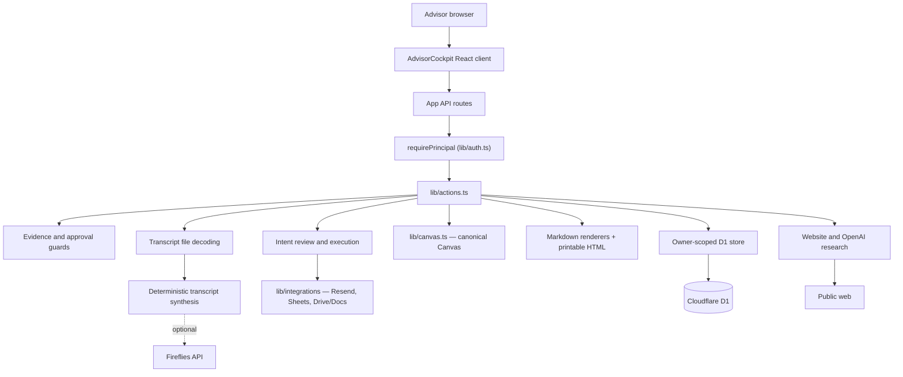
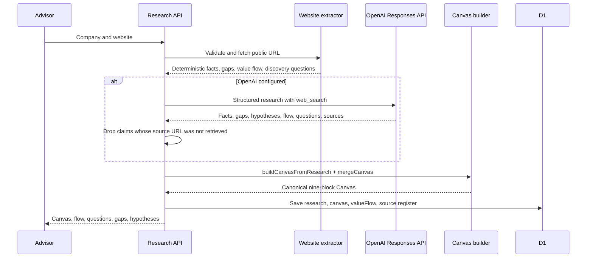
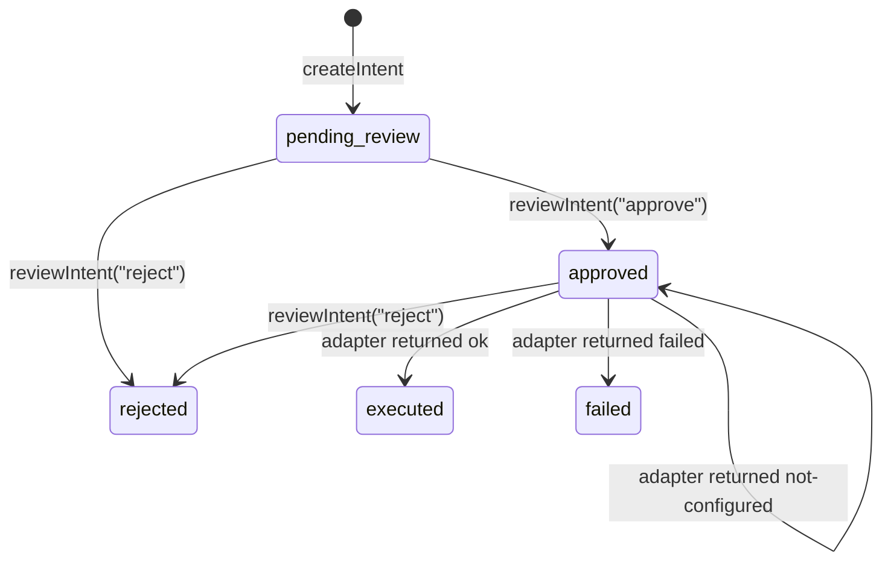

# System architecture

## Runtime

The application is a Next-compatible React application built with vinext and Vite for a Cloudflare Worker runtime. OpenAI Sites supplies the current hosting environment, D1 binding, outer access control, and production environment variables.

## Source responsibilities

| Layer | Responsibility |
| --- | --- |
| `AdvisorCockpit.tsx` | Client workflow and screen state. Value flow, call script, and integration statuses are read from the server, not hardcoded |
| `app/api/` | HTTP boundary, input routing, and principal resolution |
| `lib/auth.ts` | Principal resolution from Sites identity headers, dev fallback, and the derived `ownerId` |
| `lib/actions.ts` | Engagement actions, workflow orchestration, intent review, and the single place external writes are invoked |
| `lib/guards.ts` | Consent, immutable-artifact, approval, and evidence requirements |
| `lib/canvas.ts` | The one canonical Canvas: build, merge, apply client corrections, coverage, confirmation test |
| `lib/research.ts` | URL normalization, SSRF/DNS/redirect/size protection, public fetch, deterministic research including value flow and discovery questions |
| `lib/openai-research*.ts` | Structured OpenAI web research and strict source filtering |
| `lib/transcript-files.ts` | TXT, VTT, SRT, JSON, and DOCX decoding into speaker-attributed lines |
| `lib/transcript.ts` | Deterministic transcript synthesis: contradictions, Canvas updates, flow confirmations, decisions, tasks, roles, metrics, constraint selection |
| `lib/integrations/` | Resend, Google Sheets, Google Drive/Docs adapters and OAuth |
| `lib/deliverables.ts` | Markdown templates and `renderMarkdownToHtml()` |
| `lib/store.ts` | Owner-scoped D1 reads and writes, optimistic versioning, schema reconciliation |
| `lib/workflow.ts` | Shared domain types, workflow-state order, Canvas-block canonicalization, metric-delta arithmetic |

## Persistence and tenancy

D1 tables are:

- `engagements` — the structured engagement record and JSON data payload;
- `artifacts` — generated internal documents;
- `transcripts` — immutable raw text plus synthesis metadata;
- `activities` — audit history;
- `intents` — external-action payloads, status, and execution result.

Every one of these tables carries `owner_id`, and every query in `lib/store.ts` filters on it in SQL. `requireOwner()` refuses an empty owner, so an unscoped read is a runtime error rather than a leak. The practical consequence is the one worth remembering: **a row belonging to another advisor is indistinguishable from a row that does not exist** — `getEngagement`, `getArtifact`, and `getIntent` all return `null`, and the caller raises the same "not found" error.

`ownerId` is derived synchronously from the normalized advisor email by `ownerIdForEmail()` in `lib/auth.ts`. It is a stable short handle, not a secret; the normalized email remains the authority.

Migration is `drizzle/0001_tenancy.sql`, which adds `owner_id` to all five tables plus `result_json`, `updated_at`, and `executed_at` on `intents`. SQLite has no `ADD COLUMN IF NOT EXISTS`, so `ensureDatabase()` in `lib/store.ts` performs the same reconciliation guarded by `PRAGMA table_info` and then claims any row still holding `owner_id = ''` for `LEGACY_OWNER_EMAIL`. On a database that has already booted against the migration the ALTERs are a no-op.

Still absent: foreign-key enforcement, an organization or team layer above the individual advisor, retention and deletion policy, and rate limiting.

## Authentication boundary

`lib/auth.ts` resolves a `Principal` from the `oai-authenticated-user-email` header set by the hosting layer. `requirePrincipal()` raises `HttpError(401)` when no identity can be established.

- In development, and in the test suite, an absent header falls back to a single local advisor (`LOCAL_ADVISOR_EMAIL`, default `local-advisor@localhost`).
- Setting `REQUIRE_ADVISOR_AUTH=1` disables that fallback, so an unauthenticated request receives 401. Set it in any deployment reachable by more than one person.
- `app/chatgpt-auth.ts` remains the server-component counterpart for Sites sign-in redirects.

Every API route calls `requirePrincipal`, including `GET /api/integrations`. That route returns only per-provider `configured` / `not_configured` booleans, capability descriptions, and the names of expected environment variables — never a credential value — but which providers a deployment has wired up still describes the deployment, so it is scoped like everything else.

## The canonical Canvas

This resolves the source-of-truth defect the earlier wiki recorded, where the research UI read `research.facts` while `generateAuditReport()` read `engagement.data.canvas` and nothing ever wrote it, so every report block rendered "Missing".

`runResearch()` in `lib/actions.ts` now writes `engagement.data.canvas` by merging the existing Canvas with `buildCanvasFromResearch(synthesis)`. `processTranscript()` then applies `applyCanvasUpdates()` from client-stated transcript evidence. The rules in `lib/canvas.ts` are:

- all nine blocks always exist, in canonical order;
- research claims are capped at `public-research` no matter what the payload asserts;
- a client-stated claim is inserted at the front of its block and a superseded research claim is downgraded in confidence and relabelled, never deleted;
- `"Key Partnerships"` and other legacy or singular spellings resolve to the canonical block name through `canonicalCanvasBlock()` in `lib/workflow.ts`;
- a fact with no resolvable block is dropped rather than filed under a guess — the one exception is the site's own description, which is filed under Value Propositions;
- `canvasIsClientConfirmed()` fails closed: it is true only when all nine blocks carry at least one client-stated claim.

## Research request flow

## External action flow

External writes are reachable from exactly one path. `lib/actions.ts` creates every intent in `pending_review`; `reviewIntent()` handles `approve`, `reject`, and `execute`; and only `execute` on an already-approved intent calls into `lib/integrations/`.

Two details matter and are deliberate:

- `not-configured` means no network call was attempted, so the approval survives and the same intent can be executed again once the credential exists.
- A genuine failure moves to `failed` and needs a fresh approval, because the app cannot know whether the write landed.

## Transcript ingestion

`lib/transcript-files.ts` decodes an uploaded file into `[MM:SS] Speaker: text` lines using web APIs only — `atob`, `Uint8Array`, `TextDecoder`, and `DecompressionStream` with a minimal ZIP reader for DOCX. This replaces the earlier defect where the client submitted only `File.name` and analysis ran against a synthetic line. The browser reads the file, base64-encodes binary content, and posts it as `file` to `POST /api/engagements/:id/transcripts`; `processTranscript()` rejects a request carrying both `rawText` and `file`.

Format detection uses extension, then MIME type, then content sniffing, and records a warning when it falls back. Decoded text is stored as the immutable raw transcript.

## Portability

The source is portable. Cloudflare Workers is the lowest-friction non-Sites host. Moving to another runtime requires replacing `cloudflare:workers` environment access, D1, Worker bindings, the Sites identity headers read by `lib/auth.ts`, and any Sites access assumptions.
