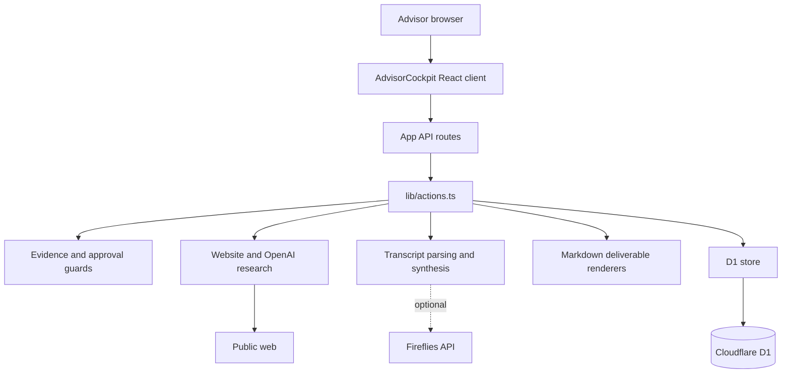
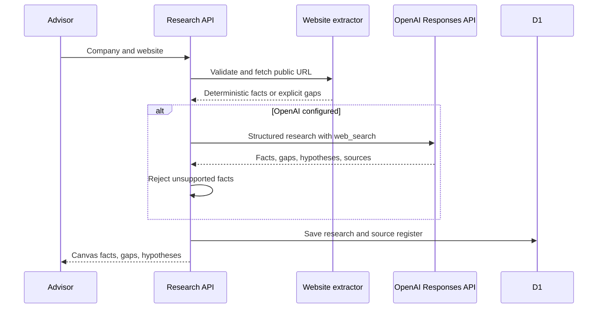

# System architecture

## Runtime

The application is a Next-compatible React application built with vinext and Vite for a Cloudflare Worker runtime. OpenAI Sites supplies the current hosting environment, D1 binding, outer access control, and production environment variables.

## Source responsibilities

| Layer | Responsibility |
| --- | --- |
| `AdvisorCockpit.tsx` | Client workflow, local screen state, API calls, and current fixed flow/call scaffolds |
| `app/api/` | HTTP boundary and input routing |
| `lib/actions.ts` | Engagement actions and workflow orchestration |
| `lib/guards.ts` | Consent, immutable-artifact, approval, and evidence requirements |
| `lib/research.ts` | URL normalization, SSRF protection, public fetch, deterministic fallback |
| `lib/openai-research*.ts` | Structured OpenAI web research and source filtering |
| `lib/transcript.ts` | Deterministic transcript parsing, metric extraction, and constraint selection |
| `lib/deliverables.ts` | Internal Markdown templates |
| `lib/store.ts` | D1 reads, writes, optimistic versioning, activities, artifacts, transcripts, and intents |
| `lib/workflow.ts` | Shared domain types and workflow-state order |

## Persistence

D1 tables are:

- `engagements` — the structured engagement record and JSON data payload;
- `artifacts` — generated internal documents;
- `transcripts` — immutable raw text plus synthesis metadata;
- `activities` — audit history;
- `intents` — pending external-action payloads.

The schema currently has no foreign-key enforcement, tenant ID, authenticated owner ID, or row-level authorization boundary.

## Research request flow

## Important source-of-truth defect

The research UI renders `research.facts` directly. The Audit Report renderer reads `engagement.data.canvas`. `runResearch()` does not currently populate that Canvas object. This creates two representations and can produce a report with Missing blocks even when the UI showed source-backed content.

The next implementation must create one versioned canonical Canvas used by the research UI, transcript reconciliation, approvals, and every document renderer.

## Authentication boundary

`app/chatgpt-auth.ts` can read Sites-authenticated identity headers and redirect to the Sites sign-in flow, but the home page and API routes do not require the helper. Production is safe only under the current outer owner-only Sites policy. Multi-advisor access requires application-layer tenancy and route authorization.

## Portability

The source is portable. Cloudflare Workers is the lowest-friction non-Sites host. Moving to another runtime requires replacing `cloudflare:workers` environment access, D1, Worker bindings, and any Sites access assumptions.
