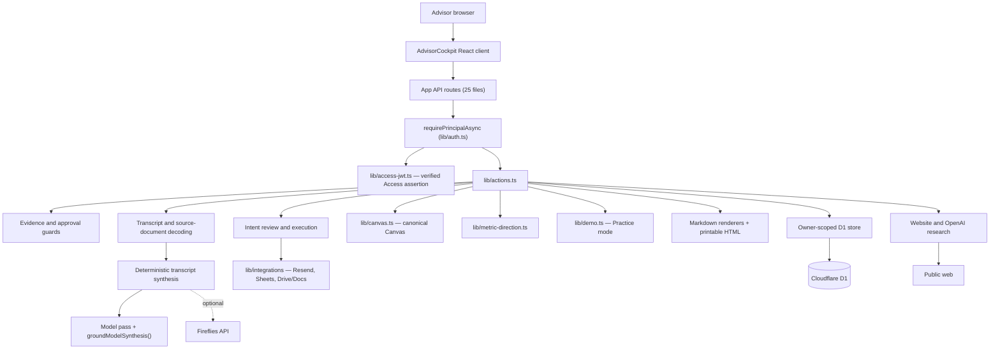
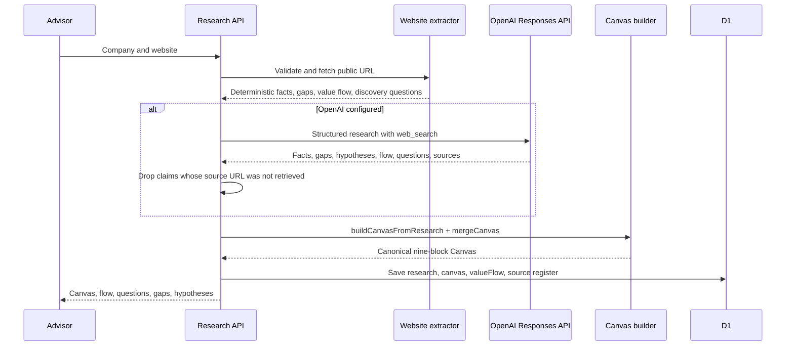
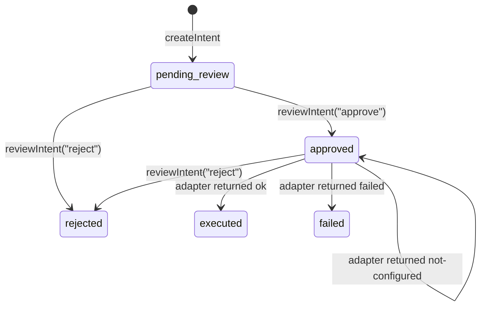

# System architecture

## Runtime

The application is a Next-compatible React application built with vinext and Vite for a Cloudflare Worker runtime. The whole advisor UI is one client component, `AdvisorCockpit.tsx`, mounted by `app/page.tsx`.

Hosting is in transition. OpenAI Sites was the original host and still supplies the `oai-authenticated-user-*` identity headers `lib/auth.ts` reads. `wrangler.jsonc` and `docs/DEPLOYMENT.md` now configure and document a self-hosted **Cloudflare Workers** deployment with Cloudflare Access in front of it. Both paths exist in the source; see [Identity and access](identity-and-access.md) for which identity source is in force under which configuration.

## Source responsibilities

| Layer | Responsibility |
| --- | --- |
| `AdvisorCockpit.tsx` | Client workflow and screen state, the seven-stage stepper, the live-call coaching rail, the Practice-mode bar and walkthrough, and resume routing |
| `app/api/` | HTTP boundary, input routing, and principal resolution — 25 route files, all async |
| `lib/auth.ts` | Principal resolution in precedence order, `advisorAuthMode()`, and the derived `ownerId` |
| `lib/access-jwt.ts` | RS256 verification of the Cloudflare Access assertion, JWKS caching, claim checks |
| `lib/actions.ts` | Engagement actions, workflow orchestration, intent review, demo seeding, and the single place external writes are invoked |
| `lib/guards.ts` | Consent, immutable-artifact, approval, patch-command, and evidence requirements |
| `lib/canvas.ts` | The one canonical Canvas: build, merge, apply client corrections, coverage, confirmation test |
| `lib/research.ts` | URL normalization, SSRF/DNS/redirect/size protection, public fetch, deterministic research including value flow and discovery questions |
| `lib/openai-research*.ts` | Structured OpenAI web research and strict source filtering |
| `lib/transcript-files.ts` | TXT, VTT, SRT, JSON, and DOCX decoding into speaker-attributed lines; also used for source-document ingest |
| `lib/transcript.ts` | Deterministic transcript synthesis: contradictions, Canvas updates, flow confirmations, decisions, tasks, roles, metrics, constraint selection |
| `lib/openai-transcript*.ts` | The model transcript pass and the grounding gate every model citation must pass |
| `lib/metric-direction.ts` | Four-tier inference of which way a metric has to move to count as an improvement |
| `lib/demo.ts` | Practice mode: one pure, deterministic, entirely fictional worked engagement |
| `lib/integrations/` | Resend, Google Sheets, Google Drive/Docs adapters, OAuth, and runtime status |
| `lib/deliverables.ts` | Markdown templates, the fixed sprint price, the findings agenda, and `renderMarkdownToHtml()` |
| `lib/store.ts` | Owner-scoped D1 reads and writes, optimistic versioning, schema reconciliation, cascade delete |
| `lib/workflow.ts` | Shared domain types, workflow-state order, Canvas-block canonicalization, metric-delta arithmetic |

## Persistence and tenancy

D1 tables are:

- `engagements` — the structured engagement record and JSON data payload;
- `artifacts` — generated internal documents and captured source documents;
- `transcripts` — immutable raw text plus synthesis metadata;
- `activities` — audit history;
- `intents` — external-action payloads, status, and execution result.

Every one of these tables carries `owner_id`, and every query in `lib/store.ts` filters on it in SQL. `requireOwner()` refuses an empty owner, so an unscoped read is a runtime error rather than a leak. The practical consequence is the one worth remembering: **a row belonging to another advisor is indistinguishable from a row that does not exist** — `getEngagement`, `getArtifact`, and `getIntent` all return `null`, and the caller raises the same "not found" error.

`ownerId` is derived synchronously from the normalized advisor email by `ownerIdForEmail()` in `lib/auth.ts`. It is a stable short handle, not a secret; the normalized email remains the authority.

There are three migrations:

| File | Adds |
| --- | --- |
| `drizzle/0000_tier4_advisor.sql` | The five tables |
| `drizzle/0001_tenancy.sql` | `owner_id` on all five tables, plus `result_json`, `updated_at`, and `executed_at` on `intents`, and the owner indexes |
| `drizzle/0002_contact_role.sql` | `primary_contact_role` on `engagements` |

SQLite has no `ADD COLUMN IF NOT EXISTS`, so `reconcileColumns()` in `lib/store.ts` performs the same reconciliation guarded by `PRAGMA table_info`, and `backfillOwners()` then claims any row still holding `owner_id = ''` for `LEGACY_OWNER_EMAIL`. On a database that has already booted against the migrations the ALTERs are a no-op. `0002_contact_role.sql` says as much in its own comment.

`primaryContactRole` exists so the named human owner required at diagnosis approval does not have to be retyped: `updateFinding()` falls back to the intake contact and role when the finding carries no owner and the request supplies none. An explicit `humanOwner` on the request always wins.

Still absent: foreign-key enforcement, an organization or team layer above the individual advisor, retention and deletion policy, and rate limiting. `deleteEngagementCascade()` exists, but only Practice mode calls it — there is no advisor-facing deletion of a real engagement.

## The canonical Canvas

`runResearch()` in `lib/actions.ts` writes `engagement.data.canvas` by merging the existing Canvas with `buildCanvasFromResearch(synthesis)`. `processTranscript()` then applies `applyCanvasUpdates()` from client-stated transcript evidence. The rules in `lib/canvas.ts` are:

- all nine blocks always exist, in canonical order;
- research claims are capped at `public-research` no matter what the payload asserts;
- a client-stated claim is inserted at the front of its block and a superseded research claim is downgraded in confidence and relabelled, never deleted;
- `"Key Partnerships"` and other legacy or singular spellings resolve to the canonical block name through `canonicalCanvasBlock()` in `lib/workflow.ts`;
- a fact with no resolvable block is dropped rather than filed under a guess — the one exception is the site's own description, which is filed under Value Propositions;
- `canvasIsClientConfirmed()` fails closed: it is true only when all nine blocks carry at least one client-stated claim.

## Research request flow

## External action flow

External writes are reachable from exactly one path. `lib/actions.ts` creates every intent in `pending_review`; `reviewIntent()` handles `approve`, `reject`, and `execute`; and only `execute` on an already-approved intent calls into `lib/integrations/`.

Two details matter and are deliberate:

- `not-configured` means no network call was attempted, so the approval survives and the same intent can be executed again once the credential exists.
- A genuine failure moves to `failed` and needs a fresh approval, because the app cannot know whether the write landed.

## Transcript and document ingestion

`lib/transcript-files.ts` decodes an uploaded file into `[MM:SS] Speaker: text` lines using web APIs only — `atob`, `Uint8Array`, `TextDecoder`, and `DecompressionStream` with a minimal ZIP reader for DOCX. The browser reads the file, base64-encodes binary content, and posts it as `file` to `POST /api/engagements/:id/transcripts` (or `/synthesis`); `processTranscript()` rejects a request carrying both `rawText` and `file`.

Format detection uses extension, then MIME type, then content sniffing, and records a warning when it falls back. Decoded text is stored as the immutable raw transcript.

The same decoder backs `POST /api/engagements/:id/sources`, which attaches a document the advisor already had — a prior proposal, an email thread, notes — to the source register. Two rules distinguish it from a transcript:

- the artifact is written with `provenance: "doc"`, never `client-stated`. Advisor-supplied material is not something the client said on a recorded call;
- **PDF is refused**, not partially handled. `ingestSourceDocument()` throws `HttpError(400, "PDF text extraction is not supported yet. Convert to DOCX, TXT, or Markdown first.")` on either a `.pdf` filename or an `application/pdf` MIME type, and the intake file picker omits `.pdf` from its `accept` list and pre-checks for it client-side.

## Transcript reasoning path

`processTranscript()` always runs the deterministic analyzer first, then hands the same lines and the full business context to `synthesizeTranscriptWithOpenAI()`. The model result never replaces the deterministic result wholesale: it is merged as a union, and every model citation must survive `groundModelSynthesis()` first. See [Model-assisted synthesis and metric direction](../domain/model-assisted-synthesis.md).

## Advisor-only client surface

`AdvisorCockpit.tsx` runs the live call on a screen the client may be looking at, so anything that is not client-safe is wrapped in an `AdvisorOnly` component that returns `null` when hidden. It is **removed from the DOM**, not merely `display: none` — a client cannot find it in a screen share, and cannot find it in the page source either.

- The coaching rail (`CoachRail`) mounts only while `presenting` is false, and offers five tabs: Go deeper, They don't know, Steer back, Pushback, Plain English.
- `Escape` is a one-way panic key. A document-level `keydown` listener over the whole call view sets `presenting` to `true` and never toggles it back, so an advisor who is suddenly asked to share has a single keystroke.
- The Practice-mode walkthrough is hidden by the same mechanism, and additionally whenever the Findings Call presentation view is open.

## Portability

The source is portable, and `wrangler.jsonc` plus `docs/DEPLOYMENT.md` make Cloudflare Workers the documented target. Moving to a third runtime requires replacing `cloudflare:workers` environment access, D1, Worker bindings, the Cloudflare Access verification in `lib/access-jwt.ts`, and the Sites identity headers read by `lib/auth.ts`.
