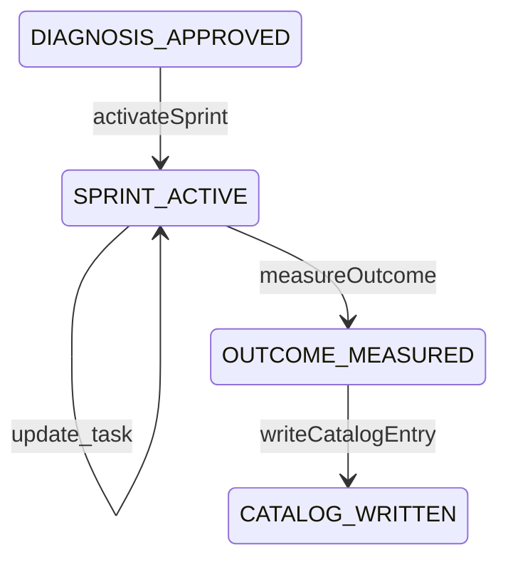

# Throughput Audit lifecycle

The canonical specification is `public/docs/workflow.md`. This page is an implementation-oriented navigation aid.

## Sequence

```mermaid
flowchart LR
    A["Recon draft"] --> B["Guided Canvas complete"]
    B --> C["Transcript 1 synthesized"]
    C --> D["Canvas commit approved"]
    D --> E["Findings Call complete"]
    E --> F["Transcript 2 reconciled"]
    F --> G["Diagnosis approved"]
    G --> H["Sprint active"]
    H --> I["Outcome measured"]
    I --> J["Catalog written"]
```

## State model

The ordered workflow states in `lib/workflow.ts` are:

1. `RECON_DRAFT`
2. `GUIDED_CANVAS_COMPLETE`
3. `TRANSCRIPT_1_SYNTHESIZED`
4. `CANVAS_COMMIT_APPROVED`
5. `FINDINGS_CALL_COMPLETE`
6. `TRANSCRIPT_2_RECONCILED`
7. `DIAGNOSIS_APPROVED`
8. `SPRINT_ACTIVE`
9. `OUTCOME_MEASURED`
10. `CATALOG_WRITTEN`

All ten states are now reachable through server actions and the UI. `assertWorkflowTransition()` enforces three hard rules:

- the workflow advances exactly one checkpoint at a time;
- an *approved* finding requires a confirmed baseline (otherwise the finding stays provisional);
- `OUTCOME_MEASURED` requires a confirmed baseline, and `CATALOG_WRITTEN` requires a measured outcome.

The advisor-facing stepper in `AdvisorCockpit.tsx` has seven stages — Client, Research, Prepare, Call, Synthesize, Deliver, **Operate** — with the Operate stage holding the Sprint, Measure, Catalog, and Reviewed-actions screens. Note that this is the *stepper*, not the CRM vocabulary: `CRM_STAGES` in `lib/workflow.ts` names the same last stage `"Sprint & Catalog"`, which is what `stageForState()` returns and what the engagement record stores. The stepper is suppressed entirely on client-facing screens.

## Resume routing

Reopening an engagement lands on the screen the checkpoint calls for. `resumeScreens` in `AdvisorCockpit.tsx` maps every `WorkflowState` directly:

| Workflow state | Screen |
| --- | --- |
| `RECON_DRAFT` | research |
| `GUIDED_CANVAS_COMPLETE` | transcript |
| `TRANSCRIPT_1_SYNTHESIZED` | synthesis |
| `CANVAS_COMMIT_APPROVED` | findings |
| `FINDINGS_CALL_COMPLETE` | transcript |
| `TRANSCRIPT_2_RECONCILED` | findings |
| `DIAGNOSIS_APPROVED` | deliver |
| `SPRINT_ACTIVE` | sprint |
| `OUTCOME_MEASURED` | catalog |
| `CATALOG_WRITTEN` | actions |

An absent or unrecognized state falls back to `research`, deliberately never to `deliver`. Resume also derives sub-state by ordinal comparison against the state list — which call number the transcript screen should expect, whether call 2 was processed, whether the diagnosis was approved — and restores recording consent from `data.recordingConsent`. A banner names the checkpoint and the screen it opened on, and is suppressed on client-facing screens.

## Recon

Recon produces:

| Output | Status |
| --- | --- |
| Company Brief artifact | Shipped |
| Business Model Canvas v0 written to `engagement.data.canvas` | Shipped |
| Source-grounded Value Flow v0 | Shipped |
| One to three constraint hypotheses | Shipped |
| Private, client-specific discovery plan | Shipped |
| Client-facing Pre-Call Readiness Brief | Shipped |
| Roster sketch | Not produced by research; roles are derived later from transcript evidence |
| Advisor-supplied source documents in the register | Shipped — `POST /api/engagements/:id/sources` |

`runResearch()` writes the canonical Canvas, the value flow, and the source register in one update, and the Company Brief artifact includes the proposed flow marked as unconfirmed.

Intake requires only the company name and the website — research reads the public site, so a site is the one thing it cannot start without. The contact block is optional there, and the contact email is collected later on the Prepare screen, immediately before the brief is sent. Intake still captures `primaryContactRole` alongside the contact name when they are supplied, so the named human owner required at diagnosis approval does not have to be retyped later.

An advisor can attach material they already had — a prior proposal, an email thread, notes — through `POST /api/engagements/:id/sources`. The file is decoded by the same decoder the transcripts use, stored as a `source_document` artifact with **`doc` provenance**, and appended to `sourceRegister`. **PDF is refused outright** with a 400 telling the advisor to convert to DOCX, TXT, or Markdown first; the file picker omits `.pdf` and pre-checks for it client-side. A silently unreadable PDF would be worse than a refusal.

The Readiness Brief is generated as a draft, approved separately, and only then may a send intent be created — `readinessBriefAction()` refuses `send_intent` unless the brief status is `Approved`, and `requireApprovedReadinessArtifact()` rejects a regenerated or mismatched artifact. Because intake no longer demands a contact email, the recipient check lives here too: `send_intent` is refused when `engagement.email` is blank, so the gate moved later in the workflow rather than disappearing. The Prepare screen is where that address is captured, and its **Approve send intent** button stays disabled until there is one.

## Call 1

The client-safe call reveals the public model live and asks one specific question at a time. The script now comes from `research.discoveryQuestions`, sorted into the seven discovery sections, with each question showing its evidence status, expected answer type, anchored Canvas block, and what was found publicly.

When research produced no questions, the UI shows four explicitly generic prompts and labels them on screen as a generic fallback that asserts nothing about the client. The old six-question `callTopics` demo script is gone.

The Flow of Work tab renders `research.valueFlow` sorted by order. When no flow exists it says so and substitutes nothing — there is no longer a default six-step flow for every company.

### Advisor-only coaching

The call screen is one the client may be looking at, so everything that is not client-safe is wrapped in `AdvisorOnly`, which returns `null` when hidden — it is **removed from the DOM**, not `display: none`. A client cannot find it in a screen share and cannot find it in the page source.

The coaching rail mounts beside the current question whenever the advisor is not presenting, with five tabs: Go deeper (the question's own `followUps` plus probes derived from its expected answer type), They don't know (probes plus a form that records who would know and where to look into the gap register), Steer back, Pushback, and Plain English. The "They don't know" tab auto-selects and shows an alert when the recorded answer is "We don't know yet".

**`Escape` is the panic key.** A document-level `keydown` listener over the whole call view sets `presenting` to `true` — one keystroke, from anywhere in the call, for an advisor who is suddenly asked to share. It is one-way: it never toggles coaching back on. The rail footer offers the same action as a button. Half-typed inputs inside the rail are lost when it unmounts; recorded answers, gap flags, and notes in the parent survive.

## Transcript 1 and Canvas commit

Transcripts arrive by paste, by file upload, or by Fireflies import. Uploaded files are decoded server-side by `lib/transcript-files.ts` into real `[MM:SS] Speaker: text` lines; the earlier defect where only the filename was submitted is fixed, and `processTranscript()` rejects a request carrying both `rawText` and `file`.

Recording consent is required before synthesis and is attested per call.

`synthesizeTranscript()` produces a diff against the researched Canvas, value flow, hypotheses, roles, and unanswered required questions: contradictions, Canvas updates, flow confirmations, decisions, tasks, roles, metrics, and a constraint candidate. Every one of those is derived only from `client-stated` lines.

**Two passes run, always in this order.** The deterministic analyzer runs first and is the floor. Its result is then handed to `synthesizeTranscriptWithOpenAI()`, which gives a reasoning model the same lines plus the research, Canvas, flow, questions, and prior calls — and every claim the model returns is re-grounded against a real `client-stated` transcript line before it is kept. Anything that cannot be tied to one is dropped and recorded in `groundingRejections`. With no `OPENAI_API_KEY`, or on any failure, the deterministic reading stands unchanged and the screen says which case applies. See [Model-assisted synthesis and metric direction](../domain/model-assisted-synthesis.md).

The resulting `canvasUpdates` are applied to the canonical Canvas through `applyCanvasUpdates()`, so the Canvas the advisor reviews is the Canvas the Audit Report renders. Canvas commit approval remains an explicit checkpoint.

## Findings Call and transcript 2

The Findings Call reconciles evidence first and reveals the prescription second. Recording consent is captured separately for Call 2.

Call 2 reconciles against Call 1 rather than overwriting it: `priorSynthesis` is passed in, prior constraint candidates are compared with the new one, and a conflict is raised as an explicit gap. A Call 2 transcript submitted before `CANVAS_COMMIT_APPROVED` is stored and synthesized but does **not** auto-advance the workflow; the engagement is marked as needing review instead.

If baseline values remain Missing:

- continue the call;
- label the diagnosis provisional;
- show only the projected-delta formula and named inputs;
- make baseline instrumentation the first Sprint task;
- start the measurement clock only after the baseline lands.

These governance rules are implemented. `updateFinding()` requires Transcript 2 reconciliation before diagnosis approval, and `requireDiagnosisApprovalEvidence()` requires client evidence and a named human owner. The owner defaults to the intake `primaryContact` and `primaryContactRole` when the finding carries none and the request supplies none; an explicit `humanOwner` always wins.

### The Findings Call agenda

`POST /api/engagements/:id/findings-agenda` builds the artifact that carries a non-expert through the most important conversation of the engagement. It takes no request body and refuses outright if no finding exists yet: *"Synthesize call 1 before building the findings agenda."*

`generateFindingsAgenda()` returns both Markdown and structured `sections`, stored as a `findings_agenda` artifact at `draft` status with `advisor-note` provenance. The UI orders the sections — What we heard, The constraint, Your own words, What we propose, What it would take, What we'd measure — and refuses an empty result rather than filling the screen: *"The findings agenda came back with no sections. Reconcile the transcript evidence before presenting."*

A separate client-facing presentation view shows one section per screen. It renders `section.evidence` under "In your own words / Recorded on the call, quoted exactly — not our paraphrase", and contains **no advisor-only content at all**.

## Deliverables

`generateDeliverables()` is blocked until `DIAGNOSIS_APPROVED` and produces **six** Markdown artifacts:

1. Diagnosis Package
2. Audit Report
3. Fixed-Sprint Proposal
4. Implementation Roadmap
5. Third-Party Developer Specification
6. Roles & Responsibility Map

Artifacts are marked `approved` only when the finding is approved; otherwise `provisional`.

The Fixed-Sprint Proposal prices from `FIXED_SPRINT_PRICE_USD = 2500` in `lib/deliverables.ts` — a fixed fee for the two-week sprint, with no invented ROI. The figure lives server-side only; no currency amount appears anywhere in the cockpit UI.

`GET /api/documents/:id?format=html` returns a self-contained printable HTML rendering via `renderMarkdownToHtml()`, which escapes content rather than executing it. There is still **no native DOCX or PDF generator**; converting an approved artifact into a Google Doc through an approved publication intent is the route to a formal document.

## Operate: sprint, outcome, catalog

**Sprint activation** (`activateSprint`, `POST /api/engagements/:id/sprint`) is blocked before diagnosis approval, refuses a second sprint, and requires a named human owner. It freezes the prescription and the starting metric and seeds three tasks: the prescription, a bottleneck-migration observation carrying the kill condition, and — only when the baseline is not confirmed — baseline instrumentation as the first task. The measurement clock starts only when the baseline is confirmed; otherwise `measurementClockStartedAt` is deliberately empty.

**Outcome measurement** (`measureOutcome`, `POST /api/engagements/:id/outcome`) requires an ending metric complete with name, value, unit, period, and source. The delta comes from `computeMetricDelta()` and is produced **only** from two client-confirmed readings in the same unit and period. Every other case stores `delta: null` plus an explicit `deltaBlockedReason` — unconfirmed baseline, non-numeric reading, or incomparable units.

`direction` is arithmetic (`increased` / `decreased` / `unchanged`). `interpretation` stays `not-interpreted` unless `computeMetricDelta()` receives `improvedWhen`.

**Which way is better is now inferred, not only declared.** `measureOutcome()` calls `resolveMetricDirection()`, whose four tiers are the advisor's own declaration, the unit table, the metric name, and — only where those are silent or fight — a model. The result is stored on `outcome.directionInference` with its source, plain-language basis, confidence, and an `ambiguous` flag.

The outcome screen previews the reading live while the advisor types, through a debounced `GET /api/metric-direction`, and distinguishes "You set this direction" from "Proposed, not decided". An ambiguous metric is never pre-selected — the advisor is asked a specific question naming both readings. After the fact, `PATCH /api/engagements/:id/outcome` with `{ improvedWhen }` corrects it: the measured numbers are immutable, the delta is recomputed from them, the inference is restamped as the advisor's own, and the outcome report is regenerated. All delta rendering is server-supplied; the browser never computes or flips an interpretation.

**Catalog write-back** (`writeCatalogEntry`, `POST /api/engagements/:id/catalog`) requires a measured outcome and records the constraint type, Canvas block, pattern, prescription, and measured result. When no delta was claimable, the catalog entry says `Not claimed` and repeats the blocked reason rather than inventing a result.

Each of the three steps also creates an artifact: Sprint Plan, Measured Outcome, Catalog Entry. A direction correction regenerates the Measured Outcome.

## External actions in the lifecycle

Nothing leaves the app as a side effect of a workflow step. Sending the readiness brief, writing the CRM row, and publishing a document are each a separate intent that must be created, approved, and then executed. See [Integration status and authorization](../integrations/status-and-authorization.md).

## Rehearsing the lifecycle

An advisor can walk this entire sequence against a fictional client before touching a real one. See [Practice mode](practice-mode.md).

## Not in the lifecycle

There is **no outreach or prospecting funnel**. The lifecycle starts at an engagement the advisor has already created by hand at intake. Nothing in the source finds, qualifies, sequences, or contacts a prospect, and no adapter exists that could.
