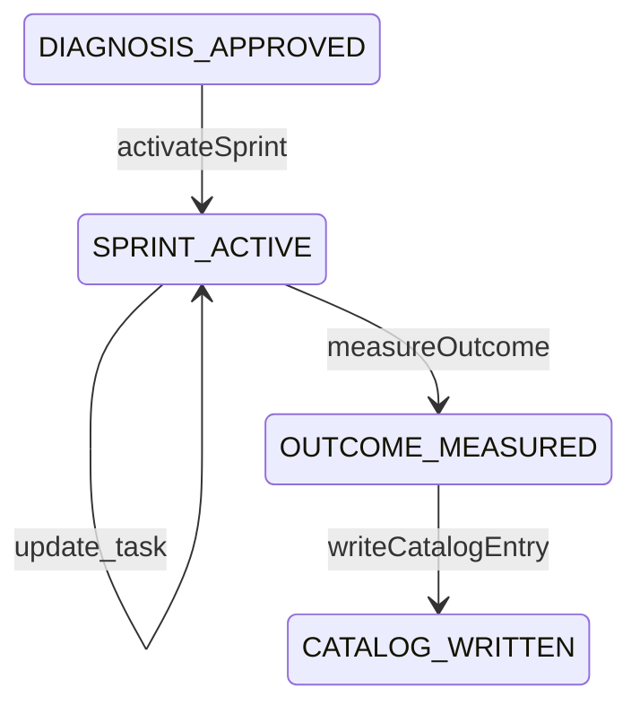

# Throughput Audit lifecycle

The canonical specification is `public/docs/workflow.md`. This page is an implementation-oriented navigation aid.

## Sequence

```mermaid
flowchart LR
    A["Recon draft"] --> B["Guided Canvas complete"]
    B --> C["Transcript 1 synthesized"]
    C --> D["Canvas commit approved"]
    D --> E["Findings Call complete"]
    E --> F["Transcript 2 reconciled"]
    F --> G["Diagnosis approved"]
    G --> H["Sprint active"]
    H --> I["Outcome measured"]
    I --> J["Catalog written"]
```

## State model

The ordered workflow states in `lib/workflow.ts` are:

1. `RECON_DRAFT`
2. `GUIDED_CANVAS_COMPLETE`
3. `TRANSCRIPT_1_SYNTHESIZED`
4. `CANVAS_COMMIT_APPROVED`
5. `FINDINGS_CALL_COMPLETE`
6. `TRANSCRIPT_2_RECONCILED`
7. `DIAGNOSIS_APPROVED`
8. `SPRINT_ACTIVE`
9. `OUTCOME_MEASURED`
10. `CATALOG_WRITTEN`

All ten states are now reachable through server actions and the UI. `assertWorkflowTransition()` enforces three hard rules:

- the workflow advances exactly one checkpoint at a time;
- an *approved* finding requires a confirmed baseline (otherwise the finding stays provisional);
- `OUTCOME_MEASURED` requires a confirmed baseline, and `CATALOG_WRITTEN` requires a measured outcome.

The advisor-facing stepper in `AdvisorCockpit.tsx` has seven stages — Client, Research, Prepare, Call, Synthesize, Deliver, **Operate** — with the Operate stage holding the Sprint, Measure, Catalog, and Reviewed-actions screens.

## Recon

Recon produces:

| Output | Status |
| --- | --- |
| Company Brief artifact | Shipped |
| Business Model Canvas v0 written to `engagement.data.canvas` | Shipped |
| Source-grounded Value Flow v0 | Shipped |
| One to three constraint hypotheses | Shipped |
| Private, client-specific discovery plan | Shipped |
| Client-facing Pre-Call Readiness Brief | Shipped |
| Roster sketch | Not produced by research; roles are derived later from transcript evidence |

`runResearch()` writes the canonical Canvas, the value flow, and the source register in one update, and the Company Brief artifact includes the proposed flow marked as unconfirmed.

The Readiness Brief is generated as a draft, approved separately, and only then may a send intent be created — `readinessBriefAction()` refuses `send_intent` unless the brief status is `Approved`, and `requireApprovedReadinessArtifact()` rejects a regenerated or mismatched artifact.

## Call 1

The client-safe call reveals the public model live and asks one specific question at a time. The script now comes from `research.discoveryQuestions`, sorted into the seven discovery sections, with each question showing its evidence status, expected answer type, anchored Canvas block, and what was found publicly.

When research produced no questions, the UI shows four explicitly generic prompts and labels them on screen as a generic fallback that asserts nothing about the client. The old six-question `callTopics` demo script is gone.

The Flow of Work tab renders `research.valueFlow` sorted by order. When no flow exists it says so and substitutes nothing — there is no longer a default six-step flow for every company.

## Transcript 1 and Canvas commit

Transcripts arrive by paste, by file upload, or by Fireflies import. Uploaded files are decoded server-side by `lib/transcript-files.ts` into real `[MM:SS] Speaker: text` lines; the earlier defect where only the filename was submitted is fixed, and `processTranscript()` rejects a request carrying both `rawText` and `file`.

Recording consent is required before synthesis and is attested per call.

`synthesizeTranscript()` produces a diff against the researched Canvas, value flow, hypotheses, roles, and unanswered required questions: contradictions, Canvas updates, flow confirmations, decisions, tasks, roles, metrics, and a constraint candidate. Every one of those is derived only from `client-stated` lines. Analysis is deterministic and reports `analysisMode: "deterministic"`; model-assisted synthesis is specified and not implemented.

The resulting `canvasUpdates` are applied to the canonical Canvas through `applyCanvasUpdates()`, so the Canvas the advisor reviews is the Canvas the Audit Report renders. Canvas commit approval remains an explicit checkpoint.

## Findings Call and transcript 2

The Findings Call reconciles evidence first and reveals the prescription second. Recording consent is captured separately for Call 2.

Call 2 reconciles against Call 1 rather than overwriting it: `priorSynthesis` is passed in, prior constraint candidates are compared with the new one, and a conflict is raised as an explicit gap. A Call 2 transcript submitted before `CANVAS_COMMIT_APPROVED` is stored and synthesized but does **not** auto-advance the workflow; the engagement is marked as needing review instead.

If baseline values remain Missing:

- continue the call;
- label the diagnosis provisional;
- show only the projected-delta formula and named inputs;
- make baseline instrumentation the first Sprint task;
- start the measurement clock only after the baseline lands.

These governance rules are implemented. `updateFinding()` requires Transcript 2 reconciliation before diagnosis approval, and `requireDiagnosisApprovalEvidence()` requires client evidence and a named human owner.

## Deliverables

`generateDeliverables()` is blocked until `DIAGNOSIS_APPROVED` and produces five Markdown artifacts:

1. Diagnosis Package
2. Audit Report
3. Fixed-Sprint Proposal
4. Implementation Roadmap
5. Third-Party Developer Specification

Artifacts are marked `approved` only when the finding is approved; otherwise `provisional`.

`GET /api/documents/:id?format=html` returns a self-contained printable HTML rendering via `renderMarkdownToHtml()`, which escapes content rather than executing it. There is still **no native DOCX or PDF generator**; converting an approved artifact into a Google Doc through an approved publication intent is the route to a formal document. A separate Roles and Responsibility Map artifact is still not generated, although role entries are captured in `engagement.data.roles`.

## Operate: sprint, outcome, catalog

**Sprint activation** (`activateSprint`, `POST /api/engagements/:id/sprint`) is blocked before diagnosis approval, refuses a second sprint, and requires a named human owner. It freezes the prescription and the starting metric and seeds three tasks: the prescription, a bottleneck-migration observation carrying the kill condition, and — only when the baseline is not confirmed — baseline instrumentation as the first task. The measurement clock starts only when the baseline is confirmed; otherwise `measurementClockStartedAt` is deliberately empty.

**Outcome measurement** (`measureOutcome`, `POST /api/engagements/:id/outcome`) requires an ending metric complete with name, value, unit, period, and source. The delta comes from `computeMetricDelta()` and is produced **only** from two client-confirmed readings in the same unit and period. Every other case stores `delta: null` plus an explicit `deltaBlockedReason` — unconfirmed baseline, non-numeric reading, or incomparable units.

The rule to preserve: `direction` is arithmetic (`increased` / `decreased` / `unchanged`), while `interpretation` stays `not-interpreted` unless the advisor declares `improvedWhen: "higher" | "lower"`. A shorter turnaround is a win; a smaller throughput is not. The app never guesses which way is better, and the outcome screen states that it does not calculate or project the number itself.

**Catalog write-back** (`writeCatalogEntry`, `POST /api/engagements/:id/catalog`) requires a measured outcome and records the constraint type, Canvas block, pattern, prescription, and measured result. When no delta was claimable, the catalog entry says `Not claimed` and repeats the blocked reason rather than inventing a result.

Each of the three steps also creates an artifact: Sprint Plan, Measured Outcome, Catalog Entry.

## External actions in the lifecycle

Nothing leaves the app as a side effect of a workflow step. Sending the readiness brief, writing the CRM row, and publishing a document are each a separate intent that must be created, approved, and then executed. See [Integration status and authorization](../integrations/status-and-authorization.md).
