# Throughput Audit lifecycle

The canonical specification is `public/docs/workflow.md`. This page is an implementation-oriented navigation aid.

## Target sequence

```mermaid
flowchart LR
    A["Recon draft"] --> B["Guided Canvas complete"]
    B --> C["Transcript 1 synthesized"]
    C --> D["Canvas commit approved"]
    D --> E["Findings Call complete"]
    E --> F["Transcript 2 reconciled"]
    F --> G["Diagnosis approved"]
    G --> H["Sprint active"]
    H --> I["Outcome measured"]
    I --> J["Catalog written"]
```

## State model

The ordered workflow states in `lib/workflow.ts` are:

1. `RECON_DRAFT`
2. `GUIDED_CANVAS_COMPLETE`
3. `TRANSCRIPT_1_SYNTHESIZED`
4. `CANVAS_COMMIT_APPROVED`
5. `FINDINGS_CALL_COMPLETE`
6. `TRANSCRIPT_2_RECONCILED`
7. `DIAGNOSIS_APPROVED`
8. `SPRINT_ACTIVE`
9. `OUTCOME_MEASURED`
10. `CATALOG_WRITTEN`

The UI and actions currently cover the audit through deliverable generation and CRM intent. Sprint measurement and catalog completion are not implemented.

## Recon requirements

Recon should produce:

- Company Brief;
- Business Model Canvas v0;
- roster sketch;
- source-grounded Value Flow v0;
- one to three constraint hypotheses;
- private, editable discovery plan;
- client-facing Pre-Call Readiness Brief.

The current app produces source-backed Canvas facts, gaps, hypotheses, and the readiness brief. The Value Flow and live-call plan are not generated from research.

## Call 1

The client-safe call experience should reveal the public model live and ask one specific question at a time. Questions must test a source-backed fact, Value Flow step, explicit gap, hypothesis, baseline, or role.

The current implementation instead uses six fixed topics defined in `callTopics` inside `AdvisorCockpit.tsx`.

## Transcript 1 and Canvas commit

The target synthesis is a diff against the researched Canvas, Value Flow, hypotheses, roles, and unanswered questions. The current parser preserves supported timestamp/speaker lines but selects constraints through fixed keyword lists.

Canvas commit approval is explicit and working. The canonical versioned Canvas update is not.

## Findings Call and transcript 2

The Findings Call reconciles evidence first and reveals the prescription second. Recording consent is captured separately for Call 2.

If baseline values remain Missing:

- continue the call;
- label the diagnosis provisional;
- show only the projected-delta formula and named inputs;
- make baseline instrumentation the first Sprint task;
- start the measurement clock only after the baseline lands.

These governance rules are implemented. Full transcript-2 history reconciliation remains shallow.

## Deliverables

The target suite is Diagnosis Package, Audit Report, Proposal and Business Case, Implementation Roadmap, Roles and Responsibility Map, and Third-Party Developer Specification. The app currently generates five Markdown artifacts; it omits a separate Roles Map artifact and has no external renderer.
