# Tier 4 Throughput Audit
## Corrected Sales-to-Delivery Workflow for Codex

**Status:** Approved workflow specification — Pre-Call Readiness Addendum incorporated  
**Purpose:** Define the evidence-grounded, two-call workflow that locates the single constraint governing a client's throughput, validates it with the client, prescribes the smallest intervention that removes it, measures the result, and writes the outcome back to the Tier 4 intervention catalog.

---

## 1. Governing Method

In any business, one constraint governs total system throughput. The Tier 4 Throughput Audit exists to:

1. Locate **the constraint**.
2. Classify it as `capacity`, `latency`, `quality`, `knowledge`, or `policy`.
3. Evidence it with the client's own words and numbers.
4. Prescribe the smallest intervention that removes it.
5. Name one baseline metric and one accountable human owner.
6. Measure the before-and-after result.
7. Record where the constraint moved next.

The intervention may or may not use AI. AI is an implementation option, not the organizing frame of the diagnosis.

The primary deliverable is:

> **One constraint → one prescription → one metric → one named human owner**

Secondary opportunities belong in an appendix labeled:

> **Not the constraint — revisit after it moves.**

---

## 2. Evidence and Provenance Model

Keep the original evidence model exactly:

`Known / Inferred / Assumed / Missing`

Map it to Tier 4 provenance as follows:

| Evidence status | Tier 4 provenance | Meaning |
| --- | --- | --- |
| Known | `client-stated` or `doc` | Directly stated by the client or supported by a supplied authoritative document |
| Inferred | `public-research` | Derived from external research and not yet confirmed by the client |
| Assumed | `advisor-note` | A working advisor hypothesis that must be confirmed or killed |
| Missing | `gap` | Required information that has not been established |

Preserve the traceability chain verbatim:

`claim → customer statement → transcript → confirmation status → recommendation → implementation`

Deterministic evidence must remain separate from AI interpretation. Research, documents, transcript quotes, timestamps, calculations, and system measurements are evidence. Advisor synthesis and model-generated interpretations must be labeled as such.

---

## 3. Canonical Engagement Record

Each engagement has one canonical record in Drive. It stores links and structured state; it does not replace the original source material.

The engagement record contains:

1. Client and engagement metadata.
2. Source register.
3. Company Brief.
4. Canvas v0 and later revisions.
5. Roster sketch.
6. Constraint hypotheses.
7. Generated question set.
8. Pre-Call Readiness Brief, its source-register entry, and send metadata.
9. Fireflies transcript links.
10. Synthesis diff.
11. Roles & Responsibility Map.
12. Baseline metric.
13. Approved or Provisional Constraint Finding.
14. Prescription and projected delta.
15. Named human owner.
16. Deliverable links.
17. Sprint measurement.
18. Constraint migration note.
19. Catalog write-back status.

No public-research claim, transcript claim, number, or recommendation is promoted without its provenance and source.

---

## 4. End-to-End Workflow

```mermaid
flowchart LR
    A["Client and meeting anchor"] --> B["Recon"]
    B --> C["Canvas v0 and constraint hypotheses"]
    C --> P["Approved Pre-Call Readiness Brief"]
    P --> D["Call 1: Guided Canvas Session"]
    D --> E["Fireflies transcript 1"]
    E --> F["Synthesis diff and roles map"]
    F --> G["Checkpoint 1: Canvas commit"]
    G --> H["Call 2: Findings Call"]
    H --> I["Fireflies transcript 2"]
    I --> J["Canvas v1 and approved constraint finding"]
    J --> K["Checkpoint 2: Diagnosis approval"]
    K --> L["Diagnosis, report, offer, and developer spec"]
    L --> M["Sprint 1: Remove and measure"]
    M --> N["Constraint migration note"]
    N --> O["Catalog write-back"]
```



### Stage 1 — Recon

Recon uses:

- Calendar for meeting identity, attendees, timing, and agenda.
- Apollo for company and roster research, subject to Apollo credit approval.
- Gmail and Drive for prior correspondence, notes, proposals, and client-provided documents.
- Public research for sourced company facts.

Recon produces six artifacts.

#### 1. Company Brief

A one-page, sourced company brief covering only facts relevant to the operating model, demand, delivery flow, people, and potential constraints.

#### 2. Canvas v0

Draft all nine Business Model Canvas blocks:

- Customer Segments
- Value Propositions
- Channels
- Customer Relationships
- Revenue Streams
- Key Resources
- Key Activities
- Key Partnerships
- Cost Structure

Every entry carries:

- Provenance: `public-research`, `doc`, or `advisor-note`
- Confidence
- Source link or source label

Thin blocks are rendered as explicit gaps. They are not filled with generic language.

#### 3. Roster Sketch

Create a draft organization sketch from available company, Apollo, and public information:

- Known people
- Titles
- Team-size signals
- Reporting relationships when supported
- Explicit gaps

Public roster data remains `public-research` until the client confirms it.

#### 4. Constraint Hypotheses

Generate one to three hypotheses. Each must state:

| Field | Required content |
| --- | --- |
| Suspected canvas block | Where the constraint appears to live |
| Suspected type | `capacity`, `latency`, `quality`, `knowledge`, or `policy` |
| Evidence hint | What suggests the hypothesis |
| Confirmation condition | What evidence would strengthen it |
| Kill condition | What evidence would disprove it |

#### 5. Question Set

Questions are generated from Canvas gaps and constraint hypotheses. The gaps are the agenda.

#### 6. Pre-Call Readiness Brief

Produce a short, client-facing brief after Recon and before Call 1. Its purpose is to put the required baseline numbers within the client's reach so quantification does not stall the session.

The brief contains:

1. **What the session is**

   > “We'll walk through a map of your business we've drafted from public information. You correct it. Expect specific questions about how work actually flows.”

2. **Who should attend**

   The owner or decision-maker, plus the person who can speak to the daily operation of the main workflow.

   > “If one person prices, estimates, schedules, or approves everything, we'd love them in the room or available.”

3. **Have these within reach**

   Present these as facts to have handy, not homework to compile:

   - Monthly volumes such as bids, orders, invoices, or leads
   - Typical end-to-end turnaround time
   - What is currently waiting in queue
   - Anything declined, missed, or turned away last quarter
   - Rough cost or revenue figures the client would stand behind

   Include this reassurance:

   > “Approximate is fine. No reports, no spreadsheets — we just don't want you hunting for numbers live.”

4. **Logistics**

   - Video link
   - Duration
   - Recording and transcription disclosure:

     > “With your permission, we'll record and transcribe the session so we quote you accurately rather than paraphrasing you.”

The brief must not contain:

- The generated question set
- Constraint hypotheses
- Canvas v0
- Any preview of suspected findings

The diagnostic value of the Guided Canvas Session depends on live correction and reaction. The canvas reveal occurs on the call.

The Pre-Call Readiness Brief is always draft-only until the advisor explicitly approves sending it. Once approved, add it to the engagement record and source register. No new workflow state is required; it is part of `RECON_DRAFT` completion.

Track optional engagement metadata:

```yaml
readiness_brief_sent: false
readiness_brief_sent_at: null
```

### Stage 2 — Call 1: Guided Canvas Session

Before beginning the diagnostic session, the advisor gives the recording and transcription disclosure:

> “With your permission, we'll record and transcribe this session so we quote you accurately rather than paraphrasing you.”

Do not begin transcript capture until the disclosure and applicable consent requirements are satisfied. No additional Fireflies explanation is needed unless the client asks.

The advisor then screen-shares Canvas v0 and opens with:

> “Here is what we found publicly. Correct us.”

The session is guided, not open-ended. It updates the canvas, traces the actual operating flow, quantifies queues and delays, and creates the task-level people map.

#### Flow Tracing

- Walk through what happens between demand arriving and delivery completing.
- Identify every handoff, queue, delay, rejection, rework loop, and approval.
- Ask what is piling up now.
- Ask what was missed, declined, or turned away and why.

#### Constraint Isolation

- Test single-person dependencies.
- Identify work only one person can perform.
- Identify rules or approvals that slow work and are routinely bypassed.
- Determine whether symptoms indicate capacity, latency, quality, knowledge, or policy.

#### Quantification

Baseline numbers are required fields:

- Volume per period
- End-to-end cycle time
- Queue size
- Error or rework rate
- Work declined, missed, or delayed
- Cost of the delay or failure

If the client cannot provide a number, record `Missing` and create a named collection action. Do not substitute a benchmark.

#### Roles and Responsibility Mapping

Apply task-level decomposition only to roles inside the traced flow. For all other roles, capture only name, title, and reporting line. Full-hierarchy task decomposition belongs to post-engagement Pedigree onboarding, not the 60-minute audit.

For roles inside the traced flow, capture at task level, not merely by job title:

| Person | Reports to | Responsibilities | Tasks | Does the task | Accountable for outcome | Judgment or grind | Approval authority | Single-point dependency |
| --- | --- | --- | --- | --- | --- | --- | --- | --- |

The important pattern is:

> Low-judgment grind task + one accountable human = intervention candidate with a future human owner.

The person accountable for the outcome becomes the candidate owner for any agent or automation affecting that task.
The Roles & Responsibility Map is a first-class deliverable that pre-fills Pedigree onboarding. The interview map and the later governance map are the same artifact, captured once and carried forward into implementation.

#### Prescription Feasibility

Only after the operating constraint is understood, briefly collect:

- Data availability and sensitivity
- Technology and integration constraints
- Governance requirements
- Current AI usage

These qualify the prescription. They do not drive the diagnosis.

Do not perform maturity scoring, generic change-readiness scoring, or stakeholder mapping as a substitute for flow diagnosis.

### Stage 3 — Transcript 1 Synthesis

Fireflies is the primary evidence source. Fetch and analyze the full transcript, not only the generated summary.

Produce the synthesis diff:

| Canvas block | Original hypothesis | Verbatim client quote | Timestamp | Source | Status | Effect on diagnosis | Follow-up |
| --- | --- | --- | --- | --- | --- | --- | --- |

Allowed statuses:

- Confirmed
- Corrected
- Unresolved
- Contradicted
- Still missing
- Superseded

Verbatim quotes must preserve the client's wording and include speaker confidence, timestamp, call identity, and source link when available.

Also produce:

- Updated Canvas draft
- Roles & Responsibility Map
- Baseline-metric gaps
- Leading constraint candidate
- Evidence for and against that candidate
- Questions required before diagnosis approval

### Checkpoint 1 — Canvas Commit

The advisor reviews the synthesis in chat before anything is written to a customer-facing Google Doc or email.

After explicit approval:

1. Commit the reviewed Canvas revision and evidence diff to the engagement record.
2. Create or update the client-facing pre-read.
3. Draft, but do not send, any customer email unless separately requested.

The client-facing pre-read contains:

- What we currently believe
- What the client corrected
- The flow as understood
- The draft Roles & Responsibility Map
- Missing required numbers
- The constraint candidate, labeled as provisional
- Questions for the Findings Call

### Stage 4 — Call 2: Findings Call

The Findings Call has two parts.

Before beginning, the advisor gives the recording and transcription disclosure:

> “With your permission, we'll record and transcribe this session so we quote you accurately rather than paraphrasing you.”

Do not begin transcript capture until the disclosure and applicable consent requirements are satisfied. No additional Fireflies explanation is needed unless the client asks.

#### Part A — Reconciliation

Confirm:

- Canvas corrections
- Role and task ownership
- Missing or conflicting numbers
- Baseline metric
- Evidence that confirms or kills the leading constraint

Numbers required for the before-and-after measurement are not optional polish. They are completion criteria.

If required baseline numbers are still `Missing`:

- Present the diagnosis as **provisional**.
- Show the projected delta only as a formula with every required input named.
- Do not provide low, base, high, or point-estimate numbers.
- Do not reschedule or suppress the reveal because a number is missing.
- Never invent, benchmark-substitute, or imply the missing number.
- Make baseline instrumentation the first task of Sprint 1.
- Start the before-and-after measurement clock only when the baseline is captured.

#### Part B — Reveal

Present:

`Canvas → constraint → prescription → projected metric delta → named human owner`

Close with:

> “This is yours either way — run with it internally, or we remove the constraint in a fixed sprint and measure the before/after together.”

Fireflies records the Findings Call and supplies the second transcript.

### Stage 5 — Transcript 2 Reconciliation

Reconcile Transcript 2 against the committed Canvas and provisional diagnosis. Preserve the complete history:

- Confirmed
- Corrected
- Refined
- Contradicted
- Still missing
- Superseded by later client evidence

Do not silently overwrite prior evidence.

This produces:

1. **Canvas v1 (client-verified)**
2. **Approved Constraint Finding**, or **Provisional Constraint Finding** when the baseline is still missing
3. **Roles & Responsibility Map**

An approved diagnosis includes:

- One constraint
- Constraint type
- Canvas block
- Verbatim supporting evidence
- Baseline metric
- Prescription
- Projected metric delta
- Named human owner
- Predicted next constraint

A provisional diagnosis may omit only the numeric baseline and numeric projected delta. It must still include:

- The proposed constraint and its evidence
- Constraint type and canvas block
- The prescription
- Named human owner
- Projected-delta formula
- Every named formula input
- Baseline instrumentation task
- Predicted next constraint

The finding remains `provisional` until the baseline lands and the advisor explicitly approves promotion under Checkpoint 2.

### Checkpoint 2 — Diagnosis Approval

The advisor reviews and explicitly approves the diagnosis before final reports, proposals, roadmaps, specifications, Drive documents, or customer emails are published.

`DIAGNOSIS_APPROVED` means the advisor approved the current diagnosis, evidence label, and customer-facing release. It does not automatically convert a provisional finding into an approved finding. If the baseline is missing, Sprint 1 may begin only with the approved baseline-instrumentation task; numeric claims remain blocked.

No polished output may convert an unresolved assumption into a finding.

---

## 5. Deliverable Suite

### Diagnosis Package

- Canvas v1
- Constraint card
- Constraint type and canvas block
- Verbatim evidence quotes and timestamps
- Baseline metric
- The prescription
- Projected metric delta
- Named human owner
- Predicted next constraint
- Appendix: “Not the constraint — revisit after it moves”

When the baseline is missing, label the package **Provisional Diagnosis** and replace numeric projected-delta fields with the formula, named inputs, and instrumentation plan.

### Audit Report

Organize the report canvas-block by canvas-block and end in the single constraint finding.

Do not include a generic AI maturity section. Data and technology readiness appear only under prescription feasibility.

### Proposal and Business Case

Build the offer through the Offer OS value equation:

- **Dream outcome:** the metric delta
- **Likelihood:** strength of client evidence plus measured results from prior engagements
- **Time:** fixed two-week sprint
- **Effort:** “We build; your person approves.”

Provide formulas and validation questions; never invent ROI.

### Implementation Roadmap

The roadmap is:

1. **Sprint 1:** Remove the constraint and measure the before-and-after result.
2. **Constraint migration note:** Record where the bottleneck moved.
3. **Retainer loop:** Diagnose and remove the next constraint.

Governance is not a later phase. It is a design invariant applied to every intervention.

### Third-Party Developer Specification

Every implementation specification must include:

| Required field | Meaning |
| --- | --- |
| Human owner | Named person accountable for the agent or automation |
| Scope | What the system may do, including autonomy level: `drafts-for-review`, `monitored`, or `autonomous` |
| Guardrails / ceiling | What the system may never do |

No agent ships without all three fields.

The specification also includes:

- Functional requirements
- Data inputs and outputs
- Integrations
- Permissions
- Decision and approval points
- Audit and evidence requirements
- Error and escalation behavior
- Acceptance criteria
- Baseline and target metric
- Measurement instrumentation

---

## 6. Constraint Card Schema

```yaml
constraint_id: ""
client: ""
canvas_block: ""
constraint_type: "capacity | latency | quality | knowledge | policy"
finding_status: "provisional | client-verified | approved"
symptoms:
  - statement: ""
    number: ""
evidence:
  - quote: ""
    speaker: ""
    timestamp: ""
    transcript_url: ""
    provenance: "client-stated"
baseline_metric:
  name: ""
  value: ""
  unit: ""
  period: ""
  source: ""
prescription:
  description: ""
  why_smallest_intervention: ""
projected_delta:
  formula: ""
  named_inputs: []
  low: ""
  base: ""
  high: ""
  confidence: ""
baseline_instrumentation:
  required: false
  first_sprint_task: ""
  measurement_clock_starts_when: ""
human_owner:
  name: ""
  role: ""
predicted_next_constraint: ""
kill_condition: ""
appendix_items: []
```

---

## 7. Workflow State Model

The Codex tool should use explicit states:

1. `RECON_DRAFT`
2. `GUIDED_CANVAS_COMPLETE`
3. `TRANSCRIPT_1_SYNTHESIZED`
4. `CANVAS_COMMIT_APPROVED`
5. `FINDINGS_CALL_COMPLETE`
6. `TRANSCRIPT_2_RECONCILED`
7. `DIAGNOSIS_APPROVED`
8. `SPRINT_ACTIVE`
9. `OUTCOME_MEASURED`
10. `CATALOG_WRITTEN`

Artifact promotion must follow the state model. For example:

- A provisional constraint cannot become approved before the baseline is captured and promotion is explicitly approved under `DIAGNOSIS_APPROVED`.
- A customer-facing document cannot be created or updated before the relevant approval checkpoint.
- The approved Pre-Call Readiness Brief is an allowed `RECON_DRAFT` artifact; its send status is tracked as metadata rather than a new state.
- `SPRINT_ACTIVE` may begin with baseline instrumentation while the finding is provisional, but numeric projected-delta claims remain blocked and the measurement clock has not started.
- A catalog entry cannot be written before the outcome is measured or explicitly recorded as failed/incomplete.

---

## 8. Catalog Write-Back

Every completed engagement ends with a catalog write-back.

Record:

- Constraint type and canvas block
- Intervention performed
- Starting metric
- Ending metric
- Actual delta
- Time to result
- Human owner
- Scope and guardrails
- Failure notes
- Adoption or operating issues
- Whether the predicted next constraint materialized
- Reusable pattern
- Evidence links

This is the compounding asset of the Tier 4 model: every measured engagement improves the intervention catalog and makes the next diagnosis more evidence-based.

---

## 9. Connector and Sales Workflow Responsibilities

| Capability | Responsibility |
| --- | --- |
| Calendar | Resolve both calls, attendees, timing, and meeting context |
| Apollo | Company and roster research; never treated as transcript or CRM truth |
| Gmail | Prior context and reviewed customer drafts |
| Google Drive | Canonical engagement record and approved artifacts |
| Fireflies | Full transcripts, timestamps, quotes, decisions, and commitments |
| Sales meeting preparation | Recon-to-call briefs and gap-driven agendas |
| Sales post-call follow-up | Transcript-grounded synthesis, actions, and reviewed drafts |
| Sales customer quotes | Verbatim evidence with speaker confidence and provenance |
| Sales business case | Evidence-grounded value case adapted to one prescription and one metric |
| Codex artifact workflow | Canvas, diagnosis, proposal, roadmap, specification, and catalog state |

Initial outputs remain chat-first. External writes, document creation, updates, and emails require explicit approval.

---

## 10. Language Contract

Use these replacements in prompts, schemas, and templates:

| Avoid | Use |
| --- | --- |
| AI opportunities | Constraint hypotheses |
| Pain points | Constraint symptoms, with a number |
| Use cases | Interventions or prescriptions |
| AI maturity / readiness | Data readiness for the prescribed intervention |
| Recommendations | The prescription, plus an appendix |
| How the client could use AI | Locate the single constraint limiting throughput and put a number on removing it |

The workflow must never drift back into a portfolio-style AI opportunity assessment.
